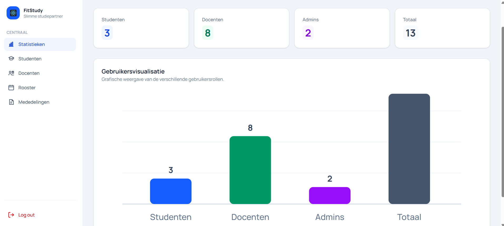
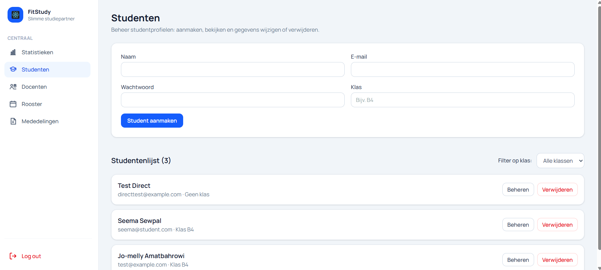
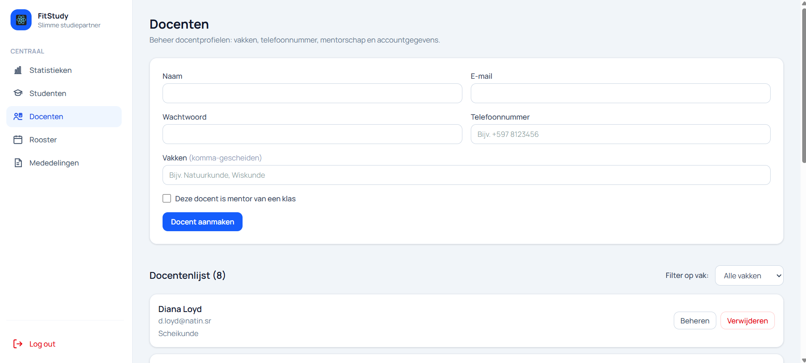
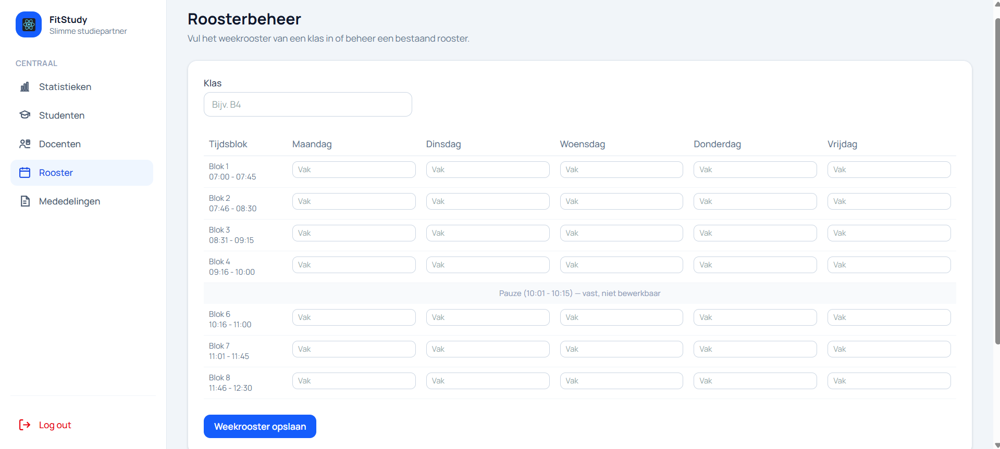
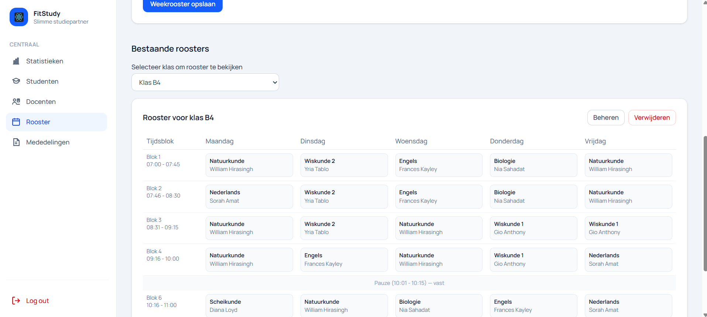
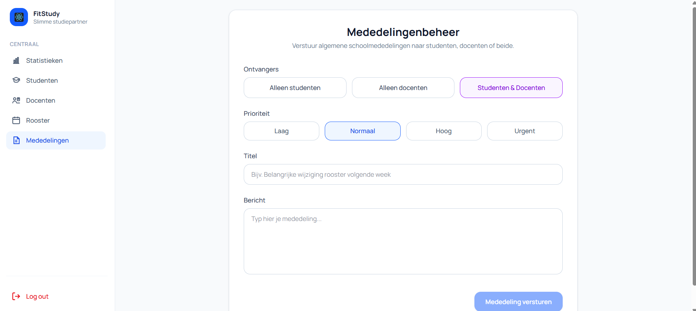

Het admin-dashboard is bedoeld voor administrators die gebruikers, roosters en algemene mededelingen binnen FitStudy beheren.

Na het inloggen komt de admin automatisch terecht op het admin-dashboard.

## Statistieken

De pagina **Statistieken** geeft de administrator een algemeen overzicht van het aantal gebruikers binnen FitStudy.

Op deze pagina ziet de admin in één oogopslag hoeveel gebruikers er in het systeem staan.

### Onderdelen van de statistiekenpagina

De statistiekenpagina bestaat uit de volgende onderdelen:

- **Studenten**  
  Toont het totaal aantal studenten dat in FitStudy is geregistreerd.

- **Docenten**  
  Toont het totaal aantal docenten dat in het systeem aanwezig is.

- **Admins**  
  Toont het totaal aantal administrators dat toegang heeft tot het admin-dashboard.

- **Totaal**  
  Toont het totaal aantal gebruikers binnen de applicatie.

### Gebruikersvisualisatie

Onder de overzichtskaarten staat een grafische weergave van de gebruikersrollen.

Deze grafiek maakt zichtbaar hoe de gebruikers verdeeld zijn over de verschillende rollen:

- studenten;
- docenten;
- admins;
- totaal aantal gebruikers.

Hierdoor kan de admin snel controleren hoeveel gebruikers er per rol aanwezig zijn.

### Gebruik van deze pagina

De admin gebruikt deze pagina vooral om snel inzicht te krijgen in de omvang van het systeem.

Bijvoorbeeld:

- hoeveel studenten zijn aangemaakt;
- hoeveel docenten zijn gekoppeld;
- hoeveel admins er zijn;
- hoeveel gebruikers er in totaal actief zijn binnen FitStudy.

### Belangrijk

De pagina **Statistieken** is alleen bedoeld voor administrators.

Studenten en docenten hebben geen toegang tot deze pagina.

## Studenten

De pagina **Studenten** wordt gebruikt om studentaccounts te beheren.

Op deze pagina kan de admin nieuwe studenten aanmaken en bestaande studenten bekijken, beheren of verwijderen.

### Student aanmaken

Bovenaan de pagina staat een formulier waarmee de admin een nieuwe student kan toevoegen.

De admin vult hiervoor de volgende gegevens in:

- naam;
- e-mailadres;
- wachtwoord;
- klas.

Na het invullen van de gegevens klikt de admin op **Student aanmaken**.

Daarna wordt het studentaccount toegevoegd aan FitStudy.

### Studentenlijst

Onder het formulier staat de **Studentenlijst**.

In deze lijst ziet de admin welke studenten al in het systeem staan.

Per student worden onder andere de volgende gegevens getoond:

- naam van de student;
- e-mailadres;
- gekoppelde klas.

Wanneer een student nog niet aan een klas is gekoppeld, wordt dit aangegeven met **Geen klas**.

### Filteren op klas

Rechts boven de studentenlijst staat een filteroptie.

Met **Filter op klas** kan de admin studenten bekijken per klas.

Dit is handig wanneer de admin snel wil controleren welke studenten tot een bepaalde klas behoren.

### Beheren of verwijderen

Bij iedere student staan de knoppen **Beheren** en **Verwijderen**.

Met **Beheren** kan de admin de gegevens van een student aanpassen.

Met **Verwijderen** kan de admin een studentaccount uit het systeem verwijderen.

### Belangrijk

Alleen administrators kunnen studentgegevens aanmaken, aanpassen of verwijderen.

Studenten kunnen hun eigen gegevens wel bekijken, maar niet zelf wijzigen.

## Docenten

De pagina **Docenten** wordt gebruikt om docentaccounts te beheren. Op deze pagina kan de admin nieuwe docenten aanmaken en bestaande docenten bekijken, beheren of verwijderen.

### Docent aanmaken

Bovenaan de pagina staat een formulier waarmee de admin een nieuwe docent kan toevoegen. De admin vult hiervoor de naam, het e-mailadres, het wachtwoord, het telefoonnummer en de vakken van de docent in.

Bij **Vakken** kan de admin één of meerdere vakken invullen. Wanneer een docent meerdere vakken geeft, worden deze komma-gescheiden ingevoerd. Een voorbeeld hiervan is: `Natuurkunde, Wiskunde`.

Als de docent mentor is van een klas, kan de admin de optie **Deze docent is mentor van een klas** aanvinken.

Na het invullen van de gegevens klikt de admin op **Docent aanmaken**. Daarna wordt het docentaccount toegevoegd aan FitStudy.

### Docentenlijst

Onder het formulier staat de **Docentenlijst**. In deze lijst ziet de admin welke docenten al in het systeem staan.

Per docent worden onder andere de naam, het e-mailadres en de gekoppelde vakken getoond.

### Filteren op vak

Rechts boven de docentenlijst staat de optie **Filter op vak**. Hiermee kan de admin docenten bekijken per vak.

Dit is handig wanneer de admin snel wil zien welke docenten aan een bepaald vak gekoppeld zijn.

### Beheren of verwijderen

Bij iedere docent staan de knoppen **Beheren** en **Verwijderen**.

Met **Beheren** kan de admin de gegevens van een docent aanpassen. Met **Verwijderen** kan de admin een docentaccount uit het systeem verwijderen.

### Belangrijk

Alleen administrators kunnen docentgegevens aanmaken, aanpassen of verwijderen.

Docenten kunnen hun eigen gegevens bekijken, maar niet zelf hun accountgegevens aanpassen.

## Rooster

De pagina **Rooster** wordt gebruikt om weekroosters per klas te beheren.

Op deze pagina kan de admin een nieuw rooster invullen, een bestaand rooster bekijken, een rooster aanpassen of een rooster verwijderen.

### Roosterbeheer

Bovenaan de pagina staat het onderdeel **Roosterbeheer**.

Hier kan de admin een weekrooster aanmaken voor een klas. De admin vult eerst de klas in, bijvoorbeeld `B4`.

Daarna kan de admin per dag en per tijdsblok het juiste vak invullen.

Het rooster is verdeeld over de schooldagen:

- maandag;
- dinsdag;
- woensdag;
- donderdag;
- vrijdag.

Per dag zijn er vaste lesblokken. Elk blok heeft een begintijd en eindtijd. In het invulveld kan de admin het vak plaatsen dat op dat moment gegeven wordt.

De pauze staat vast in het rooster en kan niet worden aangepast. Dit wordt aangegeven met:

**Pauze (10:01 - 10:15) — vast, niet bewerkbaar**

Wanneer het rooster volledig is ingevuld, klikt de admin op **Weekrooster opslaan**.

Daarna wordt het rooster opgeslagen in FitStudy en kan het worden gebruikt binnen het student- en docentdashboard.

### Bestaande roosters

Onder het roosterbeheer staat het onderdeel **Bestaande roosters**.

Hier kan de admin opgeslagen roosters bekijken.

De admin kiest eerst een klas via **Selecteer klas om rooster te bekijken**.

Daarna toont FitStudy het rooster dat voor die klas is opgeslagen.

In het rooster ziet de admin:

- de tijdsblokken;
- de dagen van de week;
- de vakken per lesblok;
- de gekoppelde docent per vak.

### Beheren of verwijderen

Bij een bestaand rooster staan de knoppen **Beheren** en **Verwijderen**.

Met **Beheren** kan de admin een bestaand rooster aanpassen.

Met **Verwijderen** kan de admin een rooster uit het systeem verwijderen.

### Belangrijk

Alleen administrators kunnen roosters aanmaken, aanpassen of verwijderen.

Studenten en docenten kunnen hun rooster bekijken, maar zij kunnen het rooster niet zelf wijzigen.

## Mededelingen

De pagina **Mededelingen** wordt gebruikt om algemene berichten te versturen naar gebruikers binnen FitStudy.

Via deze pagina kan de admin een mededeling sturen naar studenten, docenten of naar beide groepen tegelijk.

### Ontvangers kiezen

Bovenaan het formulier kiest de admin naar wie de mededeling gestuurd moet worden.

De admin kan kiezen uit:

- **Alleen studenten**;
- **Alleen docenten**;
- **Studenten & Docenten**.

Hiermee bepaalt de admin welke gebruikersgroep de melding ontvangt.

### Prioriteit kiezen

Daarna kiest de admin de prioriteit van de mededeling.

De beschikbare opties zijn:

- **Laag**;
- **Normaal**;
- **Hoog**;
- **Urgent**.

De prioriteit geeft aan hoe belangrijk de mededeling is.

### Titel en bericht invullen

Bij **Titel** vult de admin een korte titel in voor de mededeling.

Bij **Bericht** vult de admin de volledige tekst van de mededeling in.

Een voorbeeld van een mededeling is:

`Belangrijke wijziging rooster volgende week`

### Mededeling versturen

Wanneer alle velden zijn ingevuld, klikt de admin op **Mededeling versturen**.

Daarna wordt de mededeling opgeslagen en zichtbaar bij de gekozen gebruikers.

Studenten en docenten kunnen de mededeling bekijken via het bel-icoon op hun dashboard.

### Belangrijk

Alleen administrators kunnen algemene mededelingen versturen.

Studenten en docenten kunnen mededelingen ontvangen en bekijken, maar zij kunnen zelf geen algemene schoolmededelingen versturen.

## Afmelden en meerdere tabbladen

Onderaan het admin-dashboard staat de knop **Log out**.

Met deze knop kan de admin veilig uitloggen uit FitStudy. Wanneer de admin op **Log out** klikt, wordt de actieve sessie afgesloten. Daarna moet de gebruiker opnieuw inloggen om weer toegang te krijgen tot het dashboard.

### Meerdere tabbladen open

Tijdens het testen kan er soms een foutmelding ontstaan wanneer meerdere FitStudy-tabbladen tegelijk openstaan.

Dit kan bijvoorbeeld gebeuren wanneer:

- in één tabblad het admin-dashboard openstaat;
- in een ander tabblad het student- of docentdashboard openstaat;
- er met verschillende gebruikersrollen tegelijk wordt getest;
- de browser nog een oude sessie heeft onthouden.

Hierdoor kan het systeem tijdelijk in de war raken over welke gebruiker of rol actief is.

### Oplossing

Wanneer dit gebeurt, kan de gebruiker het volgende doen:

- klik op **Log out**;
- sluit de andere FitStudy-tabbladen;
- open FitStudy opnieuw;
- log opnieuw in met het juiste account.

Daarna wordt de juiste sessie opnieuw geladen en werkt het dashboard weer correct.

### Belangrijk

Gebruik tijdens het testen bij voorkeur één actieve FitStudy-sessie tegelijk.

Wanneer er getest moet worden met meerdere rollen, zoals student, docent en admin, is het overzichtelijker om eerst uit te loggen voordat er met een andere gebruiker wordt ingelogd.