Het docent-dashboard is bedoeld voor docenten die hun studenten, studievoortgang en welzijn willen bekijken en begeleiden.

Na het inloggen komt de docent automatisch terecht op het docentenportaal.

## Portaal

Na het inloggen komt de docent terecht op het **portaal** van FitStudy.  
Het portaal is het startscherm van het docent-dashboard en geeft een snel overzicht van de studenten.

Op deze pagina kan de docent onder andere:

- de studenten bekijken;
- zien in welke klas een student zit;
- zoeken naar een student op naam;
- studenten filteren op klas;
- meer informatie over een student bekijken.

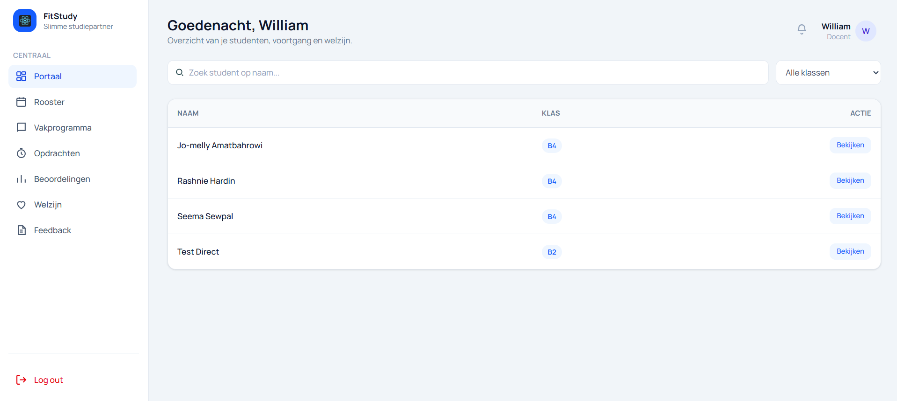

### Onderdelen van het portaal

Het portaal bestaat uit de volgende onderdelen:

- **Zoekbalk:** hiermee kan de docent een student op naam zoeken.
- **Klassenfilter:** hiermee kan de docent studenten filteren op klas. Standaard worden **Alle klassen** weergegeven.
- **Studentenoverzicht:** toont de studenten die beschikbaar zijn voor de docent.
- **Naam:** toont de naam van de student.
- **Klas:** toont de klas waarin de student zit.
- **Bekijken:** opent meer informatie over de geselecteerde student.

### Stappen om het portaal te gebruiken

1. Bekijk het overzicht van de studenten.
2. Gebruik de **zoekbalk** om een student op naam te zoeken.
3. Gebruik **Alle klassen** om studenten van een bepaalde klas weer te geven.
4. Zoek de gewenste student in het overzicht.
5. Klik op **Bekijken** om meer informatie over de student te openen.

### Student bekijken

Wanneer de docent bij een student op **Bekijken** klikt, wordt een venster geopend met aanvullende informatie over de geselecteerde student.

Bovenaan het venster worden de **naam** en **klas** van de student weergegeven.

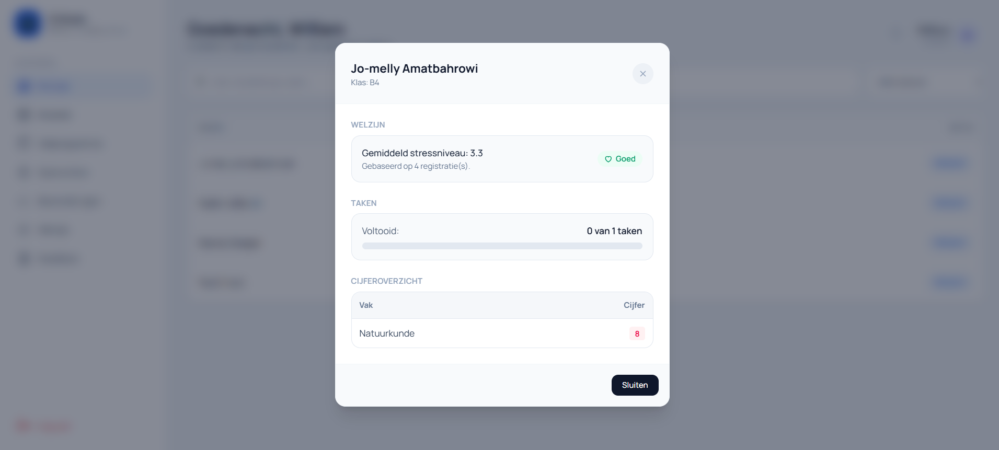

### Onderdelen van het studentenoverzicht

In het studentenoverzicht kan de docent de volgende informatie bekijken:

- **Welzijn:** toont het gemiddelde stressniveau van de student. Ook wordt weergegeven op hoeveel registraties het gemiddelde is gebaseerd en wat de huidige welzijnsstatus is.
- **Taken:** toont hoeveel taken de student heeft voltooid ten opzichte van het totale aantal taken.
- **Voortgangsbalk:** geeft visueel weer hoeveel taken de student heeft voltooid.
- **Cijferoverzicht:** toont de vakken van de student en de bijbehorende cijfers.
- **Sluiten:** sluit het studentenoverzicht en brengt de docent terug naar het portaal.

### Stappen om studentgegevens te bekijken

1. Zoek de gewenste student in het studentenoverzicht.
2. Klik bij de student op **Bekijken**.
3. Bekijk het **welzijn**, de **taken** en het **cijferoverzicht** van de student.
4. Klik op **Sluiten** of op het kruisje rechtsboven om het venster te sluiten.

### Opmerking

De informatie die in het studentenoverzicht wordt weergegeven, is afhankelijk van de gegevens die voor de geselecteerde student beschikbaar zijn.

---

## Rooster

Op de pagina **Rooster** kan de docent zijn of haar lesrooster bekijken.

Het rooster wordt door de **administrator** opgesteld. De lessen die door de administrator aan de docent zijn toegewezen, worden automatisch in het rooster van de docent weergegeven.

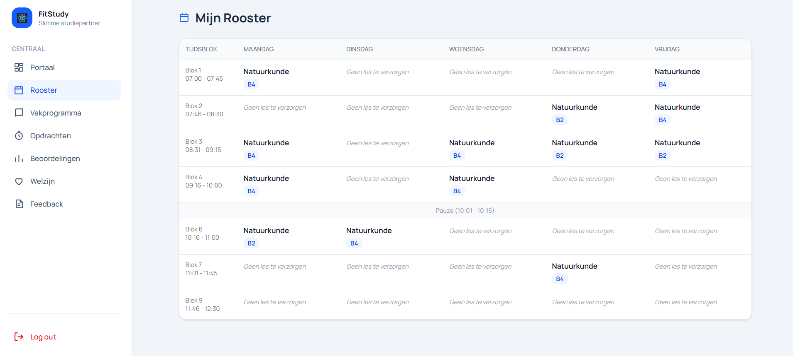

### Onderdelen van het rooster

Het rooster bestaat uit de volgende onderdelen:

- **Tijdsblok:** toont het lesblok en de bijbehorende begin- en eindtijd.
- **Maandag t/m vrijdag:** toont per dag welke lessen de docent moet verzorgen.
- **Vak:** toont het vak dat tijdens het betreffende lesblok wordt gegeven.
- **Klas:** onder het vak wordt weergegeven aan welke klas de docent lesgeeft.
- **Geen les te verzorgen:** geeft aan dat de docent tijdens dat tijdsblok geen les heeft.
- **Pauze:** toont het tijdstip waarop de pauze plaatsvindt.

### Rooster bekijken

De docent kan het rooster als volgt gebruiken:

1. Klik in het navigatiemenu op **Rooster**.
2. Bekijk aan de linkerkant het gewenste **tijdsblok**.
3. Zoek vervolgens de gewenste **dag**.
4. Bekijk welk **vak** tijdens dat tijdsblok wordt gegeven.
5. Onder het vak is te zien aan welke **klas** de docent lesgeeft.
6. Wanneer **Geen les te verzorgen** wordt weergegeven, heeft de docent tijdens dat tijdsblok geen toegewezen les.

### Belangrijk

Het rooster van de docent is gekoppeld aan de planning die door de **administrator** wordt gemaakt. Wanneer de administrator een les aan de docent toewijst, wordt deze in het rooster van de docent weergegeven.

### Opmerking

Het rooster geeft de docent een overzicht van de lessen voor de volledige schoolweek, zodat snel kan worden bekeken op welke dag, op welk tijdstip en aan welke klas les moet worden gegeven.

---

## Vakprogramma

Op de pagina **Vakprogramma** kan de docent het behandelplan voor zijn of haar vak beheren.

De docent kan hier per klas en per periode aangeven welke **hoofdstukken, lessen en onderdelen** behandeld worden. Onderaan de pagina wordt het huidige behandelplan per klas weergegeven.

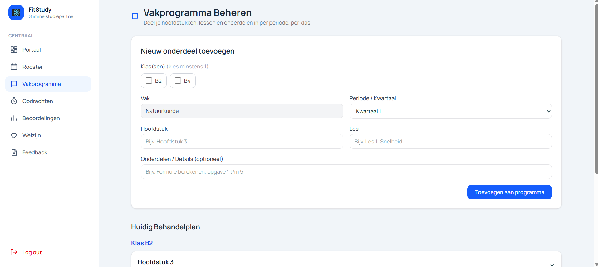

### Onderdelen van het vakprogramma

Het vakprogramma bestaat uit de volgende onderdelen:

- **Klas(sen):** hiermee selecteert de docent voor welke klas of klassen het onderdeel wordt toegevoegd. Er moet minimaal één klas worden gekozen.
- **Vak:** toont het vak waarvoor het programma wordt opgesteld.
- **Periode / Kwartaal:** hiermee kiest de docent in welke periode het onderdeel wordt behandeld.
- **Hoofdstuk:** hier vult de docent het hoofdstuk in dat behandeld wordt.
- **Les:** hier vult de docent de naam of het onderwerp van de les in.
- **Onderdelen / Details:** hier kan de docent optioneel extra informatie over de les toevoegen, bijvoorbeeld specifieke onderwerpen of opdrachten.
- **Toevoegen aan programma:** voegt de ingevulde informatie toe aan het behandelplan.

### Stappen om een onderdeel toe te voegen

1. Selecteer één of meerdere **klassen**.
2. Controleer het weergegeven **vak**.
3. Selecteer de gewenste **periode of het kwartaal**.
4. Vul bij **Hoofdstuk** het hoofdstuk in.
5. Vul bij **Les** de betreffende les in.
6. Voeg indien nodig extra informatie toe bij **Onderdelen / Details**.
7. Klik op **Toevoegen aan programma**.
8. Het nieuwe onderdeel wordt toegevoegd aan het huidige behandelplan.

### Huidig behandelplan

Onder **Huidig Behandelplan** ziet de docent welke onderdelen al aan het vakprogramma zijn toegevoegd.

De informatie wordt per **klas** weergegeven.

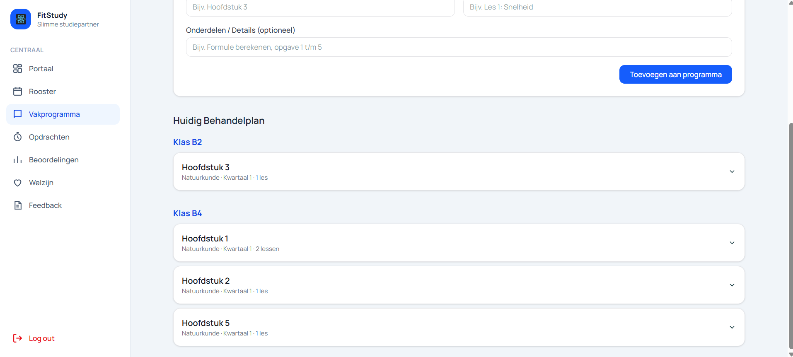

### Onderdelen van het huidige behandelplan

In het huidige behandelplan wordt de volgende informatie weergegeven:

- **Klas:** geeft aan voor welke klas het behandelplan geldt.
- **Hoofdstuk:** toont het hoofdstuk dat aan het programma is toegevoegd.
- **Vak:** toont bij welk vak het hoofdstuk hoort.
- **Periode:** toont in welk kwartaal het hoofdstuk wordt behandeld.
- **Aantal lessen:** geeft aan hoeveel lessen onder het betreffende hoofdstuk zijn toegevoegd.
- **Uitklappijl:** hiermee kan de docent een hoofdstuk openen om de bijbehorende informatie verder te bekijken.

### Behandelplan bekijken

1. Ga naar **Huidig Behandelplan**.
2. Zoek de gewenste **klas**.
3. Bekijk de hoofdstukken die voor deze klas zijn toegevoegd.
4. Klik op de **uitklappijl** naast een hoofdstuk om meer informatie te bekijken.

### Opmerking

Een hoofdstuk kan meerdere lessen bevatten. Hierdoor kan de docent het vakprogramma stap voor stap opbouwen en per klas bijhouden welke leerstof binnen een bepaalde periode behandeld wordt.

---

## Opdrachten

Op de pagina **Opdrachten** kan de docent nieuwe opdrachten aanmaken en publiceren voor een klas.

De beschikbare klassen zijn gekoppeld aan het **rooster van de docent**. Hierdoor kan de docent alleen opdrachten publiceren voor klassen waaraan hij of zij lesgeeft.

Daarnaast kan de docent onderaan de pagina de voortgang van eerder gepubliceerde opdrachten bekijken.

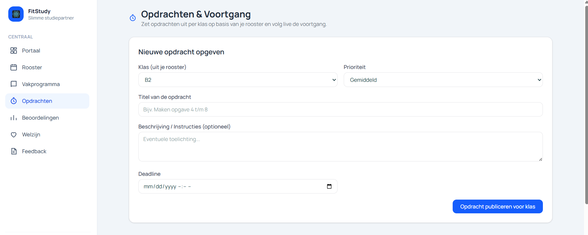

### Onderdelen van een nieuwe opdracht

Bij **Nieuwe opdracht opgeven** zijn de volgende onderdelen beschikbaar:

- **Klas:** hiermee kiest de docent voor welke klas de opdracht wordt gepubliceerd. De beschikbare klassen worden uit het rooster van de docent gehaald.
- **Prioriteit:** hiermee kan de docent aangeven hoe belangrijk de opdracht is.
- **Titel van de opdracht:** hier vult de docent de naam of opdrachtomschrijving in.
- **Beschrijving / Instructies:** hier kan de docent optioneel extra uitleg of instructies voor de studenten toevoegen.
- **Deadline:** hiermee stelt de docent de datum en het tijdstip in waarop de opdracht uiterlijk moet zijn uitgevoerd.
- **Opdracht publiceren voor klas:** publiceert de opdracht voor de geselecteerde klas.

### Stappen om een opdracht te publiceren

1. Selecteer bij **Klas** de klas waarvoor de opdracht bestemd is.
2. Kies de gewenste **prioriteit**.
3. Vul de **titel van de opdracht** in.
4. Voeg indien nodig extra uitleg toe bij **Beschrijving / Instructies**.
5. Stel een **deadline** in.
6. Controleer de ingevoerde gegevens.
7. Klik op **Opdracht publiceren voor klas**.
8. De opdracht wordt beschikbaar voor de studenten van de geselecteerde klas.

### Statistieken en voortgang

Onder het formulier staat het onderdeel **Statistieken & Voortgang per Opdracht**.

Hier kan de docent bekijken welke opdrachten eerder zijn gepubliceerd en hoeveel studenten hebben aangegeven dat zij de opdracht hebben voltooid.

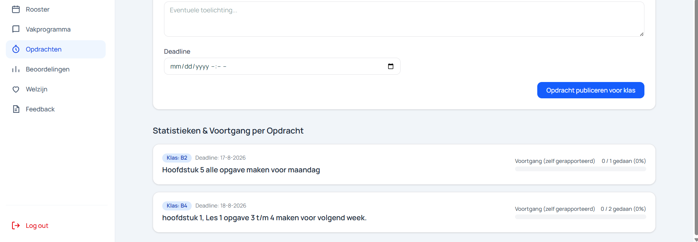

### Onderdelen van statistieken en voortgang

Per opdracht wordt de volgende informatie weergegeven:

- **Klas:** toont voor welke klas de opdracht is gepubliceerd.
- **Deadline:** toont wanneer de opdracht uiterlijk moet zijn uitgevoerd.
- **Opdracht:** toont de titel van de gepubliceerde opdracht.
- **Voortgang:** toont hoeveel studenten de opdracht als voltooid hebben geregistreerd.
- **Percentage:** geeft aan welk percentage van de studenten de opdracht heeft voltooid.
- **Voortgangsbalk:** geeft de voortgang van de klas visueel weer.

### Voortgang bekijken

1. Ga naar **Statistieken & Voortgang per Opdracht**.
2. Zoek de gewenste opdracht.
3. Controleer voor welke **klas** de opdracht is gepubliceerd.
4. Bekijk de bijbehorende **deadline**.
5. Bekijk hoeveel studenten de opdracht als voltooid hebben geregistreerd.
6. Gebruik het **percentage** en de **voortgangsbalk** om snel de voortgang van de klas te beoordelen.

### Opmerking

De voortgang bij een opdracht is gebaseerd op de voortgang die studenten zelf in FitStudy registreren. Hierdoor kan de docent snel zien hoeveel studenten aangeven dat zij de opdracht hebben voltooid.

---

## Beoordelingen

Op de pagina **Beoordelingen** kan de docent cijfers invoeren voor toetsen en opdrachten en de resultaten van studenten bekijken.

De docent kan de resultaten per klas filteren en krijgt daarnaast een snel overzicht van het aantal **voldoendes**, **onvoldoendes** en **beoordeelde studenten**.

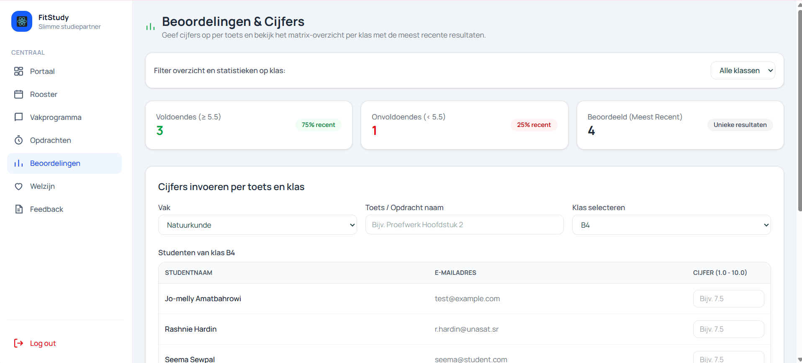

### Onderdelen van beoordelingen

Bovenaan de pagina worden statistieken van de ingevoerde cijfers weergegeven:

- **Filter op klas:** hiermee kan de docent de statistieken voor een specifieke klas bekijken.
- **Voldoendes:** toont hoeveel meest recente resultaten een cijfer van **5.5 of hoger** hebben.
- **Onvoldoendes:** toont hoeveel meest recente resultaten een cijfer **lager dan 5.5** hebben.
- **Beoordeeld:** toont het aantal studenten waarvoor een meest recent resultaat beschikbaar is.

### Cijfers invoeren

Onder **Cijfers invoeren per toets en klas** kan de docent nieuwe cijfers registreren.

De volgende onderdelen zijn beschikbaar:

- **Vak:** hiermee selecteert de docent het vak waarvoor de cijfers worden ingevoerd.
- **Toets / Opdracht naam:** hier vult de docent de naam van de toets of opdracht in.
- **Klas selecteren:** hiermee kiest de docent voor welke klas de cijfers worden ingevoerd.
- **Studentnaam:** toont de studenten van de geselecteerde klas.
- **E-mailadres:** toont het e-mailadres van iedere student.
- **Cijfer:** hier kan de docent per student een cijfer van **1.0 tot en met 10.0** invoeren.
- **Alle ingevulde cijfers opslaan:** slaat de ingevoerde cijfers van de studenten op.

### Stappen om cijfers in te voeren

1. Selecteer het juiste **vak**.
2. Vul bij **Toets / Opdracht naam** de naam van de beoordeling in.
3. Selecteer de gewenste **klas**.
4. De studenten van de geselecteerde klas worden automatisch weergegeven.
5. Vul bij iedere student het behaalde **cijfer** in.
6. Controleer de ingevoerde cijfers.
7. Klik op **Alle ingevulde cijfers opslaan** om de resultaten te bewaren.

### Overzicht ingevoerde cijfers

Onder **Overzicht Ingevoerde Cijfers per Klas** kan de docent de eerder opgeslagen cijfers van studenten bekijken.

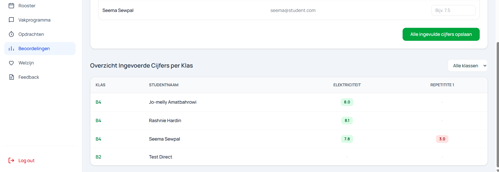

### Onderdelen van het cijferoverzicht

In het cijferoverzicht wordt de volgende informatie weergegeven:

- **Klassenfilter:** hiermee kan de docent de resultaten van één specifieke klas bekijken. Met **Alle klassen** worden de resultaten van alle beschikbare klassen weergegeven.
- **Klas:** toont in welke klas de student zit.
- **Studentnaam:** toont de naam van de student.
- **Toetsen / Opdrachten:** iedere ingevoerde toets of opdracht wordt als aparte kolom weergegeven.
- **Cijfer:** toont het behaalde cijfer van de student voor de betreffende toets of opdracht.
- **Geen cijfer:** wanneer nog geen cijfer beschikbaar is, wordt een streepje weergegeven.

### Cijfers bekijken

1. Ga naar **Overzicht Ingevoerde Cijfers per Klas**.
2. Gebruik indien nodig het filter **Alle klassen** om een specifieke klas te selecteren.
3. Zoek de gewenste student in het overzicht.
4. Bekijk per toets of opdracht welk cijfer de student heeft behaald.

### Opmerking

De statistieken bovenaan de pagina zijn gebaseerd op de meest recente resultaten. Het volledige cijferoverzicht onderaan de pagina kan worden gebruikt om de ingevoerde cijfers per student, klas en toets te bekijken.

---

## Welzijn

Op de pagina **Welzijn** kan de docent het welzijn van studenten bekijken en volgen.

De pagina geeft een overzicht van de welzijnsstatus van studenten op basis van hun registraties. De docent kan hiermee snel zien welke studenten mogelijk extra aandacht nodig hebben.

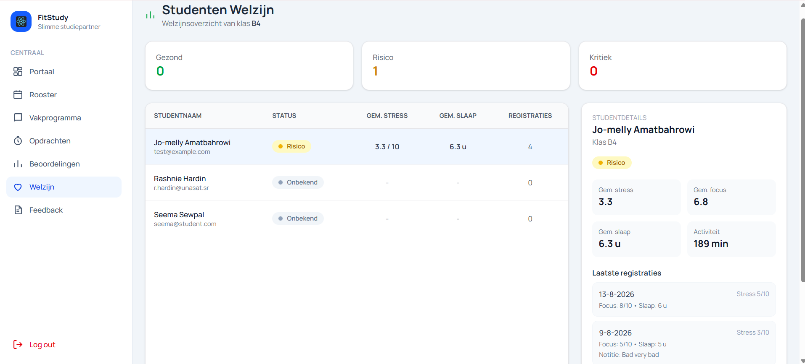

### Onderdelen van het welzijnsoverzicht

Bovenaan de pagina wordt een samenvatting van de welzijnsstatus weergegeven:

- **Gezond:** toont hoeveel studenten een gezonde welzijnsstatus hebben.
- **Risico:** toont hoeveel studenten signalen vertonen die extra aandacht kunnen vereisen.
- **Kritiek:** toont hoeveel studenten een kritieke welzijnsstatus hebben.

### Studentenoverzicht

In het studentenoverzicht wordt per student de volgende informatie weergegeven:

- **Studentnaam:** toont de naam en het e-mailadres van de student.
- **Status:** toont de actuele welzijnsstatus van de student, bijvoorbeeld **Gezond**, **Risico**, **Kritiek** of **Onbekend**.
- **Gem. stress:** toont het gemiddelde stressniveau van de student.
- **Gem. slaap:** toont het gemiddeld aantal uren slaap.
- **Registraties:** toont hoeveel welzijnsregistraties de student heeft ingevuld.

Wanneer nog geen registraties beschikbaar zijn, wordt de status **Onbekend** weergegeven.

### Studentdetails bekijken

Wanneer de docent een student selecteert, worden rechts op de pagina de **studentdetails** weergegeven.

Hier kan de docent aanvullende informatie over de geselecteerde student bekijken, waaronder:

- **Naam en klas:** toont welke student is geselecteerd en in welke klas de student zit.
- **Welzijnsstatus:** toont de actuele status van de student.
- **Gem. stress:** toont het gemiddelde stressniveau.
- **Gem. focus:** toont het gemiddelde focusniveau.
- **Gem. slaap:** toont het gemiddeld aantal uren slaap.
- **Activiteit:** toont de geregistreerde activiteit van de student in minuten.

### Laatste registraties

Onder **Laatste registraties** kan de docent de meest recente welzijnsregistraties van de student bekijken.

Per registratie wordt onder andere weergegeven:

- de **datum** van de registratie;
- het geregistreerde **stressniveau**;
- het **focusniveau**;
- het aantal uren **slaap**;
- een eventuele **notitie** van de student.

### Stappen om het welzijn van een student te bekijken

1. Klik in het navigatiemenu op **Welzijn**.
2. Bekijk bovenaan het algemene welzijnsoverzicht.
3. Zoek de gewenste student in de lijst.
4. Klik op de student om de **studentdetails** te openen.
5. Bekijk de gemiddelde waarden voor **stress**, **focus**, **slaap** en **activiteit**.
6. Bekijk onder **Laatste registraties** de recente welzijnsgegevens van de student.

### Opmerking

De welzijnsgegevens zijn gebaseerd op de registraties die studenten zelf in FitStudy invoeren. Wanneer een student nog geen welzijnsregistraties heeft ingevuld, kan er nog geen welzijnsstatus worden bepaald en wordt de status **Onbekend** weergegeven.

---

## Feedback

Op de pagina **Feedback** kan de docent feedback en mededelingen naar studenten sturen.

De docent kan hierbij kiezen tussen een **persoonlijke notitie** voor één student of een **klasmededeling** voor een groep studenten.

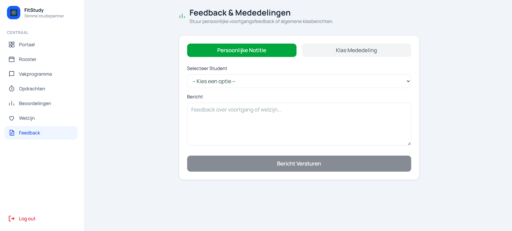

### Onderdelen van feedback

Bovenaan de pagina kan de docent kiezen uit twee soorten berichten:

- **Persoonlijke Notitie:** hiermee kan de docent een persoonlijk bericht of individuele feedback naar één student sturen.
- **Klas Mededeling:** hiermee kan de docent een algemeen bericht voor een klas versturen.

### Persoonlijke notitie versturen

Bij **Persoonlijke Notitie** zijn de volgende onderdelen beschikbaar:

- **Selecteer Student:** hiermee kiest de docent de student voor wie het bericht bestemd is.
- **Bericht:** hier schrijft de docent de persoonlijke feedback of mededeling.
- **Bericht Versturen:** verstuurt het bericht naar de geselecteerde student.

De persoonlijke notitie kan bijvoorbeeld worden gebruikt voor feedback over de **studievoortgang**, **opdrachten** of het **welzijn** van een student.

### Stappen om een persoonlijke notitie te versturen

1. Klik op **Persoonlijke Notitie**.
2. Selecteer bij **Selecteer Student** de gewenste student.
3. Schrijf de feedback of mededeling in het veld **Bericht**.
4. Controleer het bericht.
5. Klik op **Bericht Versturen**.

### Klasmededeling

Met **Klas Mededeling** kan de docent een algemeen bericht versturen dat bedoeld is voor een klas.

Deze functie kan bijvoorbeeld worden gebruikt voor:

- algemene informatie voor de klas;
- herinneringen aan opdrachten;
- informatie over lessen;
- belangrijke mededelingen.

### Stappen om een klasmededeling te versturen

1. Klik op **Klas Mededeling**.
2. Selecteer de gewenste klas.
3. Vul de mededeling in.
4. Controleer het bericht.
5. Verstuur de mededeling.

### Opmerking

Gebruik **Persoonlijke Notitie** wanneer het bericht alleen voor één student bedoeld is. Gebruik **Klas Mededeling** wanneer dezelfde informatie voor een volledige klas bestemd is.

---

## Log out

Wanneer de docent klaar is met het gebruik van FitStudy, kan hij of zij uitloggen via de knop **Log out** linksonder in het navigatiemenu.

Door uit te loggen wordt de actieve sessie afgesloten en keert de docent terug naar het inlogscherm.

### Stappen om uit te loggen

1. Klik linksonder in het navigatiemenu op **Log out**.
2. De huidige sessie wordt afgesloten.
3. De gebruiker wordt teruggebracht naar het **inlogscherm**.
4. Vervolgens kan indien nodig met een ander account worden ingelogd.

### Belangrijk tijdens het testen

Gebruik tijdens het testen bij voorkeur **één actieve FitStudy-sessie tegelijk**.

Wanneer er getest moet worden met meerdere rollen, zoals **student**, **docent** en **admin**, is het overzichtelijker om eerst uit te loggen voordat er met een andere gebruiker wordt ingelogd.

Hiermee wordt voorkomen dat verschillende gebruikerssessies door elkaar worden gebruikt en is duidelijk met welke rol de applicatie op dat moment wordt getest.

