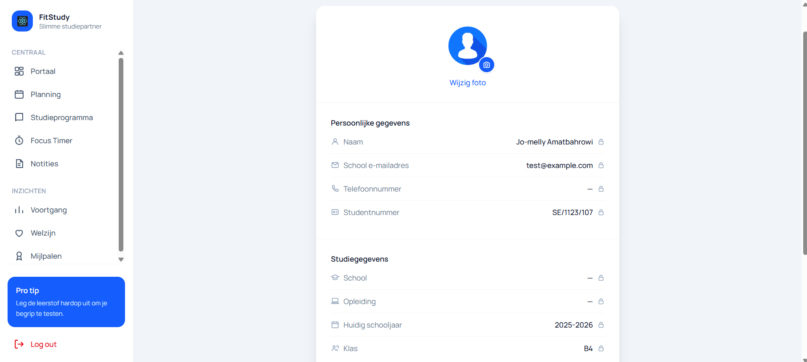
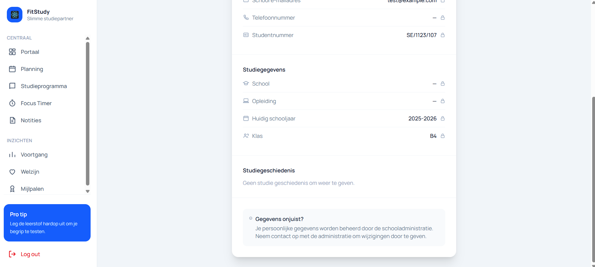
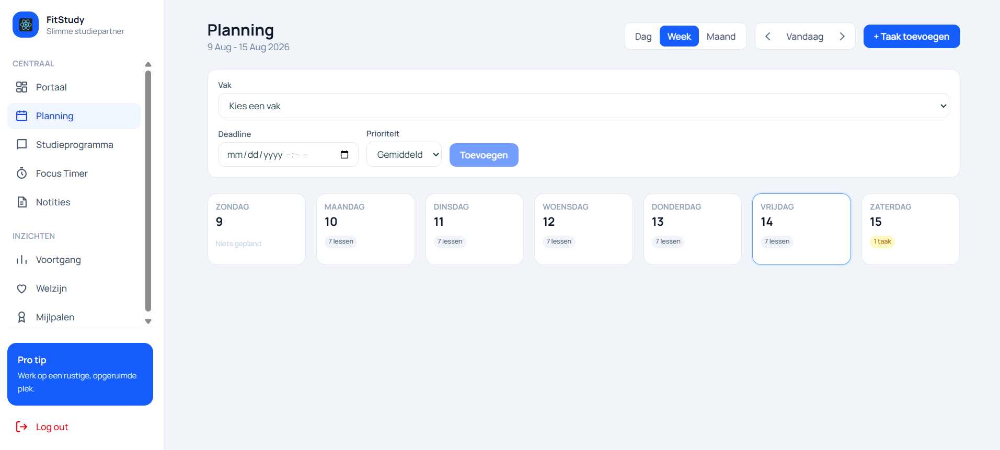
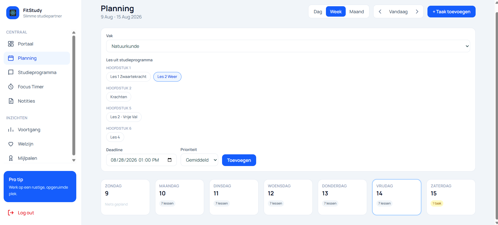
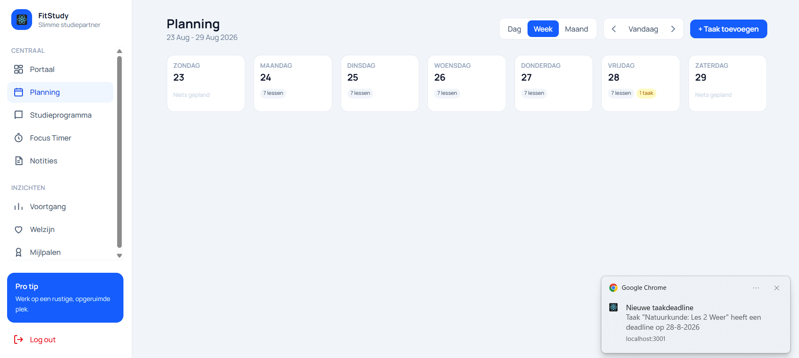
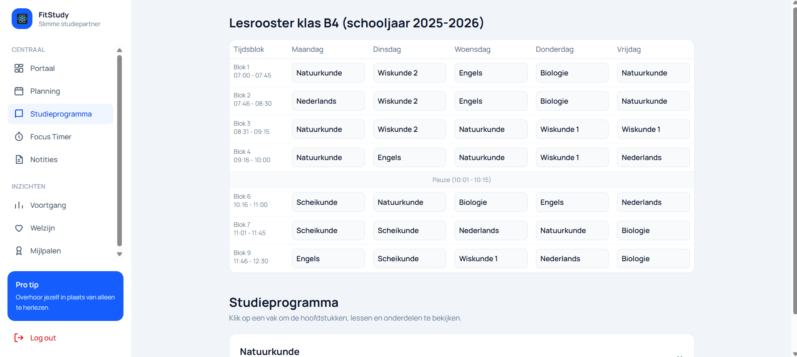
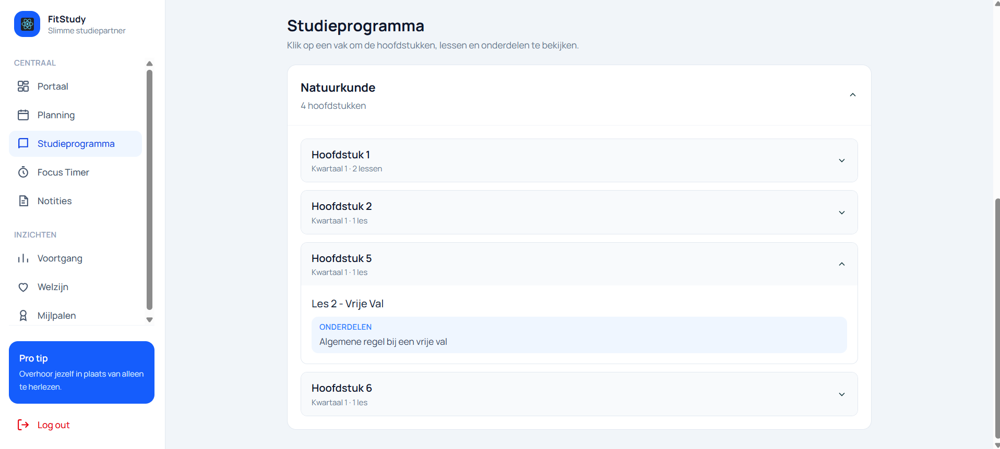

Het student-dashboard is bedoeld voor studenten die hun studieplanning, voortgang en welzijn willen beheren.

Na het inloggen komt de student automatisch terecht op het studentenportaal.

## Portaal

Na het inloggen komt de student automatisch terecht op het **Portaal** van FitStudy.

Het portaal is het startscherm van het student-dashboard en geeft een snel overzicht van de studievoortgang, planning en aankomende taken.

Bovenaan wordt de student persoonlijk begroet. Rechtsboven staan het **meldingen-icoon** en het **profiel** van de ingelogde student.

### Onderdelen van het portaal

Op het portaal ziet de student verschillende informatiekaarten en overzichten.

De belangrijkste onderdelen zijn:

- **Studie-uren deze week:** toont hoeveel tijd de student deze week aan studieactiviteiten heeft besteed.
- **Taken voltooid:** toont hoeveel taken deze week zijn afgerond.
- **Huidige streak:** toont hoeveel dagen achter elkaar de student actief is geweest.
- **Wekelijkse voortgang:** vergelijkt de huidige voortgang met die van de vorige week.
- **Schema voor vandaag:** toont de lessen die voor de huidige dag gepland staan.
- **Opkomend:** toont aankomende taken en deadlines.

### Schema voor vandaag

Onder **Schema voor vandaag** ziet de student welke lessen op de huidige dag gepland staan.

Per les kunnen onder andere de volgende gegevens zichtbaar zijn:

- het **vak**;
- de **begin- en eindtijd**;
- de **klas**.

Met **Alles bekijken** kan de student verder naar het volledige overzicht van de planning.

### Opkomende taken

Rechts op het portaal staat het onderdeel **Opkomend**.

Hier worden taken weergegeven waarvan de deadline nadert.

Per taak kan onder andere zichtbaar zijn:

- de **naam van de taak**;
- aanvullende informatie over het hoofdstuk of onderwerp;
- de **prioriteit**;
- de **deadline**.

Taken die de student zelf via **Planning** heeft toegevoegd, kunnen hier ook terugkomen.

### Meldingen

Rechtsboven op het portaal staat een **bel-icoon**.

Via dit icoon kan de student meldingen binnen FitStudy bekijken.

Meldingen kunnen bijvoorbeeld betrekking hebben op:

- nieuwe berichten of notities;
- aankomende deadlines;
- wijzigingen of andere belangrijke informatie binnen FitStudy.

Het bel-icoon geeft de student een centrale plek om belangrijke updates terug te vinden.

### Profiel

Rechtsboven op het portaal wordt ook de **naam en profielfoto** van de student weergegeven.

Wanneer de student op het profiel klikt, kan hij of zij de persoonlijke en studiegegevens bekijken.

### Persoonlijke gegevens

In het profiel worden onder andere de volgende persoonlijke gegevens weergegeven:

- **Naam**
- **School e-mailadres**
- **Telefoonnummer**
- **Studentnummer**

De student kan bovenaan ook de **profielfoto wijzigen** via **Wijzig foto**.

Bij verschillende gegevens staat een slot-icoon. Dit geeft aan dat deze gegevens niet rechtstreeks door de student aangepast kunnen worden.

### Studiegegevens

Onder de persoonlijke gegevens staat het onderdeel **Studiegegevens**.

Hier kunnen onder andere de volgende gegevens worden bekeken:

- **School**
- **Opleiding**
- **Huidig schooljaar**
- **Klas**

Ook is er een onderdeel **Studiegeschiedenis** waarin eerdere studiegegevens kunnen worden weergegeven wanneer deze beschikbaar zijn.

### Gegevens wijzigen

Niet alle profielgegevens kunnen door de student zelf worden gewijzigd.

Wanneer persoonlijke of studiegegevens niet correct zijn, wordt aangegeven dat deze gegevens door de **schooladministratie** worden beheerd.

De student moet in dat geval contact opnemen met de administratie om wijzigingen door te laten voeren.

De **profielfoto** kan wel door de student zelf worden aangepast.

### Stappen om het profiel te bekijken

Volg de onderstaande stappen om de profielgegevens te bekijken:

1. Ga naar het **Portaal**.
2. Klik rechtsboven op de **naam of profielfoto**.
3. Bekijk de **persoonlijke gegevens**.
4. Scroll verder naar de **studiegegevens**.
5. Klik op **Wijzig foto** wanneer de profielfoto aangepast moet worden.
6. Neem contact op met de schooladministratie wanneer andere gegevens gewijzigd moeten worden.

### Belangrijk

Het portaal geeft de student in één scherm een samenvatting van belangrijke informatie uit verschillende onderdelen van FitStudy.

De gegevens op het portaal worden onder andere opgebouwd vanuit de **Planning**, het **Studieprogramma**, voltooide taken en andere geregistreerde studieactiviteiten.

### Opmerking

De inhoud van het portaal kan veranderen naarmate de student nieuwe taken toevoegt, lessen volgt of andere activiteiten binnen FitStudy uitvoert.

## Planning

Op de pagina **Planning** kan de student zijn of haar lessen en zelf ingeplande taken bekijken.

De planning is gekoppeld aan het **Studieprogramma**. Hierdoor kan de student een taak aanmaken op basis van een vak en les die door de docent in het studieprogramma zijn geplaatst.

De planning kan worden bekeken in een **dag-, week- of maandweergave**.

### Onderdelen van de planning

Bovenaan de pagina zijn de volgende onderdelen beschikbaar:

- **Dag:** toont de planning van één geselecteerde dag.
- **Week:** toont een overzicht van de volledige week.
- **Maand:** toont de planning van een volledige maand.
- **Vorige en volgende:** met de pijlen kan de student naar een andere dag, week of maand navigeren.
- **Vandaag:** brengt de student terug naar de huidige datum.
- **+ Taak toevoegen:** opent het formulier waarmee een nieuwe taak kan worden ingepland.

In de weekweergave ziet de student per dag hoeveel **lessen** en **taken** zijn gepland.

### Taak toevoegen

Wanneer de student op **+ Taak toevoegen** klikt, wordt het formulier voor het toevoegen van een taak geopend.

De student kiest eerst een **vak** uit het Studieprogramma.

Nadat een vak is geselecteerd, worden automatisch de bijbehorende hoofdstukken en lessen weergegeven.

### Onderdelen van een nieuwe taak

Bij het toevoegen van een taak zijn de volgende onderdelen beschikbaar:

- **Vak:** hiermee kiest de student een vak uit het Studieprogramma.
- **Les uit studieprogramma:** toont de hoofdstukken en lessen die door de docent voor dat vak zijn toegevoegd.
- **Deadline:** hiermee kiest de student wanneer de taak uiterlijk moet worden uitgevoerd.
- **Prioriteit:** hiermee kan de student aangeven hoe belangrijk de taak is.
- **Toevoegen:** slaat de nieuwe taak op in de planning.

Bij **Prioriteit** kan de student kiezen uit:

- **Laag**
- **Gemiddeld**
- **Hoog**

### Stappen om een taak toe te voegen

Volg de onderstaande stappen om een taak aan de planning toe te voegen:

1. Klik op **+ Taak toevoegen**.
2. Selecteer het gewenste **vak**.
3. Kies een **les** uit het Studieprogramma.
4. Stel een **deadline** in.
5. Kies de gewenste **prioriteit**.
6. Klik op **Toevoegen**.
7. De taak wordt opgeslagen en verschijnt op de gekozen datum in de planning.

### Taak bekijken in de planning

Nadat de taak is toegevoegd, wordt deze automatisch bij de bijbehorende datum weergegeven.

In de **weekweergave** ziet de student bijvoorbeeld:

- het aantal lessen van die dag;
- het aantal zelf ingeplande taken.

Wanneer er één taak is gepland, wordt **1 taak** weergegeven. Bij meerdere taken wordt het totale aantal taken weergegeven.

### Dagweergave

Door op een dag te klikken kan de student de **dagweergave** openen.

Hier worden de taken van die dag afzonderlijk weergegeven. Bij een actieve taak wordt de status **Bezig** weergegeven.

De student kan een taak vervolgens een status geven, zoals:

- **Voltooid**
- **Geannuleerd**
- **Onvoltooid**

### Browsermelding

Wanneer browsermeldingen zijn ingeschakeld, kan FitStudy ook een melding tonen wanneer een taak met een deadline wordt toegevoegd.

De melding bevat informatie over:

- de naam van de taak;
- de ingestelde deadline.

Hierdoor wordt de student extra herinnerd aan geplande studietaken.

### Belangrijk

De beschikbare vakken en lessen bij **Taak toevoegen** zijn gekoppeld aan het **Studieprogramma** van de klas van de student.

Wanneer de docent nieuwe hoofdstukken of lessen aan het vakprogramma van de klas toevoegt, kunnen deze vervolgens door de student worden gebruikt om taken in de planning aan te maken.

### Opmerking

De planning combineert het schoolrooster met de persoonlijke taken van de student. Hierdoor kan de student in één overzicht zien welke lessen gepland staan en welke studietaken nog moeten worden uitgevoerd.

## Studieprogramma

Op de pagina **Studieprogramma** kan de student het lesrooster van de eigen klas en het behandelplan van de docent bekijken.

Het studieprogramma is gekoppeld aan de **klas van de ingelogde student**. Hierdoor ziet de student alleen de vakken, hoofdstukken, lessen en onderdelen die door de docent voor zijn of haar klas zijn toegevoegd.

### Lesrooster

Bovenaan de pagina wordt het **lesrooster van de klas** weergegeven.

Het rooster toont:

- de **klas** van de student;
- het huidige **schooljaar**;
- de verschillende **tijdsblokken**;
- de dagen van **maandag tot en met vrijdag**;
- welk **vak** tijdens ieder tijdsblok wordt gegeven;
- het tijdstip van de **pauze**.

Hierdoor kan de student snel bekijken welke lessen op een bepaalde dag gepland staan.

### Onderdelen van het lesrooster

Het lesrooster bestaat uit de volgende onderdelen:

- **Tijdsblok:** toont het nummer van het lesblok met de begin- en eindtijd.
- **Maandag t/m vrijdag:** toont per dag welke lessen zijn ingepland.
- **Vak:** toont welk vak tijdens het betreffende tijdsblok wordt gegeven.
- **Pauze:** geeft aan wanneer de pauze plaatsvindt.

### Studieprogramma

Onder het lesrooster staat het onderdeel **Studieprogramma**.

Hier worden de vakken weergegeven waarvoor de docent een behandelplan heeft toegevoegd.

De student kan op een vak klikken om de beschikbare hoofdstukken te bekijken.

### Onderdelen van het studieprogramma

Per vak kan de student de volgende informatie bekijken:

- **Vaknaam:** toont het vak waarvoor een programma beschikbaar is.
- **Aantal hoofdstukken:** toont hoeveel hoofdstukken door de docent zijn toegevoegd.
- **Hoofdstuk:** toont welk hoofdstuk behandeld wordt.
- **Periode / Kwartaal:** toont in welke periode het hoofdstuk wordt behandeld.
- **Aantal lessen:** toont hoeveel lessen bij het hoofdstuk horen.
- **Les:** toont de naam van de les.
- **Onderdelen:** toont aanvullende informatie of onderwerpen die bij de les behandeld worden.
- **Uitklappijl:** hiermee kan de student een vak of hoofdstuk openen en sluiten.

### Hoofdstuk bekijken

Wanneer de student een hoofdstuk openklapt, worden de bijbehorende lessen weergegeven.

Bij een les kunnen ook extra **onderdelen** zichtbaar zijn.

In het voorbeeld wordt bij **Hoofdstuk 5** onder andere weergegeven:

- **Les 2 - Vrije Val**
- **Algemene regel bij een vrije val**

Hierdoor kan de student vooraf zien welke leerstof binnen een hoofdstuk behandeld wordt.

### Stappen om het studieprogramma te gebruiken

Volg de onderstaande stappen om het studieprogramma te bekijken:

1. Klik in het linkermenu op **Studieprogramma**.
2. Bekijk bovenaan het **lesrooster** van de klas.
3. Scroll naar het onderdeel **Studieprogramma**.
4. Klik op het gewenste **vak**.
5. Bekijk de beschikbare **hoofdstukken**.
6. Klik op een hoofdstuk om de bijbehorende **lessen** te openen.
7. Bekijk indien beschikbaar de aanvullende **onderdelen** van de les.

### Koppeling met de docent

Het studieprogramma wordt opgebouwd op basis van het **Vakprogramma** dat door de docent wordt beheerd.

Wanneer de docent voor een klas een hoofdstuk, les of onderdeel toevoegt, wordt deze informatie automatisch beschikbaar voor studenten uit diezelfde klas.

Hierdoor ziet bijvoorbeeld een student uit **klas B4** alleen het behandelplan dat voor **B4** is toegevoegd.

### Koppeling met Planning

De lessen uit het Studieprogramma kunnen ook worden gebruikt bij het onderdeel **Planning**.

De student kan daar een vak en les uit het Studieprogramma selecteren en deze als persoonlijke taak inplannen met een eigen **deadline** en **prioriteit**.

### Belangrijk

De inhoud van het Studieprogramma is afhankelijk van wat de docent voor de klas heeft toegevoegd.

Wanneer voor een vak nog geen behandelplan beschikbaar is, wordt dat vak nog niet in het Studieprogramma weergegeven.

### Opmerking

Het lesrooster en het Studieprogramma hebben ieder een andere functie. Het **lesrooster** laat zien wanneer lessen plaatsvinden, terwijl het **Studieprogramma** laat zien welke hoofdstukken, lessen en onderdelen binnen een vak behandeld worden.

## Focus Timer

Via het onderdeel **Focus Timer** kan de student een focussessie starten om geconcentreerd te studeren.

In de nieuwe versie van FitStudy kiest de student eerst een **type focussessie**.  
Elke sessie heeft een eigen duur en moeilijkheidsgraad. Hierdoor kan de student een sessie kiezen die past bij de beschikbare tijd en het gewenste concentratieniveau.

### Onderdelen van de focus timer

De pagina **Focus Timer** bestaat uit verschillende focussessies die de student kan kiezen.

Per sessie zijn de volgende onderdelen zichtbaar:

- **Naam van de sessie**  
  Toont de naam van de focussessie, zoals:
  - **Pomodoro Focus**
  - **Quick Sprint**
  - **Power Focus**
  - **Deep Work**
  - **Creative Flow**

- **Beschrijving van de sessie**  
  Geeft kort aan waarvoor de sessie bedoeld is.

- **Moeilijkheidsgraad**  
  Laat zien hoe intensief de sessie is.  
  In het voorbeeld worden de niveaus weergegeven als:
  - **Makkelijk**
  - **Gemiddeld**
  - **Moeilijk**

- **Duur van de sessie**  
  Toont hoeveel minuten de focussessie duurt.

- **Startknop**  
  Met het **play-icoon** kan de student direct de gekozen focussessie starten.

### Beschikbare focussessies

De student kan kiezen uit meerdere soorten focussessies:

- **Pomodoro Focus**  
  Klassieke focussessie van **25 minuten**.

- **Quick Sprint**  
  Korte productiviteitsboost van **15 minuten**.

- **Power Focus**  
  Uitdagende diepe concentratiesessie van **35 minuten**.

- **Deep Work**  
  Verlengde concentratiesessie van **50 minuten**.

- **Creative Flow**  
  Creatieve denksessie van **45 minuten**.

### Doel van de focus timer

De focus timer helpt de student om:

- gericht aan een studiesessie te werken;
- een sessie te kiezen die past bij de beschikbare tijd;
- de concentratie te verbeteren;
- afleiding te verminderen;
- een vaste studieroutine op te bouwen.

### Stappen om de focus timer te gebruiken

Volg de onderstaande stappen om de focus timer te gebruiken:

1. Klik in het linkermenu op **Focus Timer**.
2. Bekijk de beschikbare focussessies.
3. Kies een sessie die past bij uw studiebehoefte.
4. Controleer de **duur** en de **moeilijkheidsgraad** van de sessie.
5. Klik op het **play-icoon** bij de gewenste sessie.
6. Start de focussessie en werk gedurende die tijd geconcentreerd.

### Belangrijk

De focus timer biedt meerdere soorten focussessies, zodat de student flexibel kan kiezen tussen een korte, gemiddelde of langere studiesessie.

### Opmerking

De focus timer is bedoeld als hulpmiddel om studeren beter te organiseren en de concentratie te verbeteren. De student kan zelf bepalen welke focussessie het beste past bij het moment en de studieactiviteit.

## Notities

Via het onderdeel **Notities** kan de student berichten bekijken die door docent(en) zijn verstuurd.

Deze berichten kunnen bijvoorbeeld bestaan uit:
- feedback over de voortgang;
- herinneringen aan opdrachten;
- mededelingen over lessen;
- algemene informatie voor de klas.

### Onderdelen van de notitiespagina

De pagina **Notities** bestaat uit verschillende onderdelen.

### Berichten van docent(en)

Onder de titel **Notities** ziet de student de ontvangen berichten van docent(en).

Per notitie kunnen onder andere de volgende gegevens zichtbaar zijn:
- **datum en tijd** van het bericht;
- **naam van de docent**;
- **inhoud van het bericht**.

Hierdoor kan de student eenvoudig terugzien wanneer een bericht is verstuurd en van wie het afkomstig is.

### Pop-upmeldingen in browser

Bovenaan de pagina staat de optie **Pop-upmeldingen in browser**.

Met deze optie kan de student browsermeldingen ontvangen zodra er een nieuwe notitie beschikbaar is.

Wanneer deze functie is ingeschakeld:
- ontvangt de student sneller een melding van nieuwe berichten;
- hoeft de student niet steeds handmatig te controleren of er een nieuwe notitie is.

### Notities bekijken

De notities worden in overzichtelijke berichtvakken weergegeven.

In elk berichtvak kan de student zien:
- wanneer het bericht is geplaatst;
- van welke docent het bericht afkomstig is;
- wat de mededeling of feedback inhoudt.

Op deze manier kan de student de ontvangen informatie rustig nalezen.

### Rechten van de student

De student kan notities alleen **bekijken**.

De student kan:
- geen notities aanmaken;
- geen notities wijzigen;
- geen notities verwijderen.

Notities worden geplaatst door docent(en).

### Stappen om notities te bekijken

Volg de onderstaande stappen om notities te bekijken:

1. Klik in het linkermenu op **Notities**.
2. Bekijk de ontvangen berichten van docent(en).
3. Lees per bericht de **datum**, **afzender** en **inhoud**.
4. Schakel indien gewenst **Pop-upmeldingen in browser** in.
5. Controleer regelmatig of er nieuwe notities beschikbaar zijn.

### Belangrijk

Notities zijn bedoeld als communicatie van docent(en) naar de student.  
Het is daarom belangrijk dat de student deze berichten regelmatig controleert, zodat belangrijke informatie over lessen, opdrachten of wijzigingen niet gemist wordt.

## Voortgang

Via het onderdeel **Voortgang** kan de student zijn of haar studieactiviteiten en resultaten bekijken.

Deze pagina geeft een overzicht van de voortgang binnen de huidige maand. De student kan hier onder andere zien hoeveel focussessies zijn gedaan, hoeveel taken zijn voltooid en welke cijfers zijn behaald.

### Onderdelen van de voortgangspagina

De pagina **Voortgang** bestaat uit verschillende onderdelen.

### Maandoverzicht

Bovenaan de pagina staat de naam van de huidige maand met een korte samenvatting, bijvoorbeeld:

**augustus 2026 in één overzicht**

Hiermee ziet de student dat de getoonde voortgang betrekking heeft op de geselecteerde maand.

### Overzichtskaarten

Bovenaan de pagina staan verschillende overzichtskaarten.  
Deze kaarten tonen belangrijke cijfers over de studieactiviteiten van de student.

De overzichtskaarten kunnen onder andere het volgende tonen:

- **Focussessies**  
  Toont hoeveel focussessies de student in deze maand heeft uitgevoerd.

- **Korte pauzes**  
  Toont hoeveel korte pauzes zijn genomen.

- **Lange pauzes**  
  Toont hoeveel lange pauzes zijn genomen.

- **Taken voltooid**  
  Toont hoeveel taken zijn afgerond ten opzichte van het totaal aantal taken.

Deze kaarten helpen de student om snel te zien hoe actief hij of zij is geweest.

### Rapport downloaden

Rechtsboven op de pagina staat de knop **Rapport downloaden**.

Met deze knop kan de student een voortgangsrapport downloaden.  
Dit rapport kan worden gebruikt om de eigen voortgang buiten de applicatie te bewaren of te bekijken.

### Cijfers

In het onderdeel **Cijfers** ziet de student een overzicht van behaalde resultaten.

Hier kunnen onder andere de volgende gegevens zichtbaar zijn:

- **gemiddelde deze maand**  
  Toont het gemiddelde van de cijfers die in de huidige maand zijn geregistreerd.

- **algemeen gemiddelde**  
  Toont het gemiddelde van alle geregistreerde cijfers.

- **vaknaam**  
  Toont voor welk vak een cijfer is geregistreerd.

- **datum**  
  Toont wanneer het cijfer is geregistreerd.

- **cijfer**  
  Toont het behaalde resultaat.

Dit onderdeel helpt de student om de recente resultaten snel te bekijken.

### Overzicht schooljaar

Onder **Overzicht schooljaar** ziet de student alle geregistreerde cijfers van het huidige schooljaar.

De cijfers worden weergegeven met de nieuwste resultaten eerst.

Per resultaat kunnen onder andere de volgende gegevens zichtbaar zijn:

- **vaknaam**
- **datum**
- **cijfer**

Hierdoor kan de student ook over een langere periode de schoolresultaten volgen.

### Taakvoltooiing

Onder het onderdeel **Taakvoltooiing** ziet de student hoeveel taken in de huidige maand zijn afgerond.

Dit onderdeel bevat:

- een **voortgangsbalk**;
- een **percentage** van de afgeronde taken.

Hiermee krijgt de student snel inzicht in de voortgang van de eigen planning en opdrachten.

### Stappen om de voortgang te bekijken

Volg de onderstaande stappen om de voortgang te bekijken:

1. Klik in het linkermenu op **Voortgang**.
2. Bekijk bovenaan de overzichtskaarten.
3. Controleer het aantal **focussessies**, **korte pauzes**, **lange pauzes** en **voltooide taken**.
4. Bekijk het onderdeel **Cijfers** voor de recente resultaten.
5. Bekijk het onderdeel **Overzicht schooljaar** om oudere resultaten terug te zien.
6. Controleer onder **Taakvoltooiing** hoeveel taken deze maand zijn afgerond.
7. Klik eventueel op **Rapport downloaden** om een rapport van de voortgang te downloaden.

### Belangrijk

De voortgangspagina is bedoeld om de student inzicht te geven in zijn of haar studiegedrag en prestaties.

### Opmerking

De gegevens op deze pagina zijn afhankelijk van de activiteiten en resultaten die in FitStudy zijn geregistreerd. Wanneer er nog weinig gegevens beschikbaar zijn, kunnen sommige onderdelen nog beperkt gevuld zijn.

## Welzijn

Via het onderdeel **Welzijn** kan de student werken aan een gezonde en gebalanceerde studieroutine.

Deze pagina helpt de student om niet alleen op studie te focussen, maar ook op ontspanning, motivatie, zelfreflectie en waterinname.  
Bovenaan de pagina kan de student wisselen tussen verschillende tabbladen binnen het onderdeel welzijn.

Daarnaast is rechtsboven een **statuslabel** zichtbaar, zoals **Risico**.  
Dit label geeft een algemene indicatie van het welzijn van de student op basis van de beschikbare gegevens.

### Onderdelen van welzijn

De pagina **Welzijn** bestaat uit vijf onderdelen:

- **Ontspanning**
- **Dagelijkse begeleiding**
- **Registratie**
- **Waterinname**
- **Quiz**

### Ontspanning

Bij het tabblad **Ontspanning** krijgt de student verschillende korte activiteiten te zien die helpen om te ontspannen tijdens of na het studeren.

Voorbeelden van ontspanningsactiviteiten zijn:

- **Ademhalingsoefening**
- **Strekken**
- **Meditatie**
- **Oogrust**
- **Korte wandeling**

Bij iedere activiteit staat een korte beschrijving en de duur, bijvoorbeeld **1 min**, **3 min**, **5 min** of **10 min**.

Dit onderdeel helpt de student om:
- stress te verminderen;
- tussendoor bewust te pauzeren;
- de concentratie te verbeteren;
- gezondere studiegewoonten op te bouwen.

### Dagelijkse begeleiding

Bij het tabblad **Dagelijkse begeleiding** ziet de student een motiverende tip of korte begeleidende boodschap.

Op deze pagina wordt een korte tekst getoond die de student kan ondersteunen of motiveren, bijvoorbeeld:

**"Neem het één taak tegelijk. Je kan dit!"**

Met de knop **Nieuwe tip** kan een andere motiverende boodschap worden opgehaald.

Dit onderdeel is bedoeld om de student dagelijks op een positieve manier te ondersteunen.

### Registratie

Bij het tabblad **Registratie** kan de student persoonlijke welzijnsgegevens van die dag invoeren.

Hier kan de student onder andere registreren:

- **Stressniveau**
- **Focus**
- **Uren geslapen**
- **Notities (optioneel)**

De student vult deze gegevens in met schuifbalken en een notitieveld.  
Na het invullen klikt de student op **Registreren** om de gegevens op te slaan.

Onder het registratiegedeelte kan ook een overzicht zichtbaar zijn van het **slaap- en stresspatroon van de laatste 7 dagen**.  
Hiermee kan de student beter inzicht krijgen in het eigen welzijnspatroon.

### Stappen om een welzijnsregistratie toe te voegen

Volg de onderstaande stappen om een registratie toe te voegen:

1. Klik op het tabblad **Registratie**.
2. Stel het **stressniveau** in.
3. Stel het **focusniveau** in.
4. Geef aan hoeveel **uren geslapen** zijn.
5. Voeg eventueel een **notitie** toe.
6. Klik op **Registreren**.

### Waterinname

Bij het tabblad **Waterinname** kan de student de dagelijkse waterinname bijhouden.

De student ziet hier onder andere:

- hoeveel milliliter water vandaag is geregistreerd;
- het dagelijkse doel, bijvoorbeeld **2500 ml**;
- een **voortgangsbalk**;
- snelle knoppen zoals **+150 ml**, **+250 ml** en **+500 ml**;
- een invoerveld voor een **aangepast aantal ml**;
- de knop **Loggen** om de invoer op te slaan.

Onderaan wordt ook een korte samenvatting weergegeven van de totaal gelogde hoeveelheid water.

Dit onderdeel helpt de student om tijdens het studeren voldoende water te drinken.

### Stappen om waterinname te registreren

Volg de onderstaande stappen om waterinname te registreren:

1. Klik op het tabblad **Waterinname**.
2. Kies een snelle hoeveelheid, zoals **+150 ml**, **+250 ml** of **+500 ml**.  
   of
3. Vul zelf een hoeveelheid in bij **Aangepast aantal ml**.
4. Klik op **Loggen**.
5. Controleer de voortgangsbalk en het totaal van de dag.

### Quiz

Bij het tabblad **Quiz** krijgt de student vragen over het eigen welzijn.

In de quiz wordt per vraag een situatie of gevoel voorgelegd.  
De student kiest vervolgens het antwoord dat het beste past bij de eigen situatie.

In het voorbeeld wordt onder andere gevraagd:

**"Hoe voelde je je vandaag over het algemeen?"**

Daarbij zijn antwoordopties zichtbaar zoals:

- **Energiek**
- **Neutraal**
- **Vermoeid**
- **Overweldigd**

Boven de vraag is ook zichtbaar hoeveel vragen de quiz bevat, bijvoorbeeld **Vraag 1 van 3**.

De quiz helpt de student om stil te staan bij het eigen welzijn en kan bijdragen aan een beter inzicht in de eigen mentale en fysieke toestand.

### Stappen om de quiz te gebruiken

Volg de onderstaande stappen om de quiz te gebruiken:

1. Klik op het tabblad **Quiz**.
2. Lees de vraag aandachtig.
3. Kies het antwoord dat het beste bij uw situatie past.
4. Beantwoord de volgende vragen indien beschikbaar.
5. Rond de quiz af.

### Belangrijk

Het onderdeel **Welzijn** is bedoeld om de student te ondersteunen bij een gezonde studie- en leefroutine.  
De informatie en registraties helpen de student om bewuster om te gaan met stress, focus, slaap, ontspanning en hydratatie.

### Opmerking

De weergegeven welzijnsstatus, zoals **Risico**, is afhankelijk van de gegevens die de student in FitStudy registreert. Wanneer er weinig of geen registraties beschikbaar zijn, kan het welzijnsoverzicht beperkter zijn.

## Mijlpalen

Via het onderdeel **Mijlpalen** kan de student badges en behaalde prestaties bekijken.

Deze pagina geeft een overzicht van de voortgang binnen verschillende categorieën.  
De student kan hier zien hoeveel badges al zijn behaald en welke mijlpalen nog openstaan.

### Onderdelen van de mijlpalenpagina

De pagina **Mijlpalen** bestaat uit verschillende onderdelen.

### Totaaloverzicht

Bovenaan de pagina ziet de student hoeveel badges al zijn behaald.

In het voorbeeld staat:

**2 van 32 badges behaald**

Hiermee krijgt de student direct een algemeen overzicht van de voortgang binnen het badge-systeem.

### Categorieën

De badges zijn verdeeld in verschillende categorieën.  
In het voorbeeld zijn onder andere de volgende categorieën zichtbaar:

- **Profiel**
- **Studeren**
- **Studie-uren**

Per categorie worden de bijbehorende badges overzichtelijk weergegeven.

### Badge-informatie

Per badge kan de student de volgende informatie bekijken:

- **Naam van de badge**  
  Toont de naam van de mijlpaal, bijvoorbeeld:
  - **Eerste indruk**
  - **Eerste stap**
  - **Focus gevonden**
  - **Doorzetter**
  - **Focusmeester**

- **Beschrijving**  
  Geeft aan wat de student moet doen om de badge te behalen.

- **Zeldzaamheid / niveau**  
  Toont het type badge, bijvoorbeeld:
  - **Common**
  - **Uncommon**

### Voorbeelden van badges

Op de pagina kunnen bijvoorbeeld badges zichtbaar zijn zoals:

- **Eerste indruk**  
  Wijzig voor het eerst je profielfoto.

- **Eerste stap**  
  Voltooi je eerste studiesessie.

- **Focus gevonden**  
  Start 10 focussessies.

- **Doorzetter**  
  Start 50 focussessies.

- **Focusmeester**  
  Start 100 focussessies.

Deze badges helpen de student om gemotiveerd te blijven en stap voor stap doelen te behalen.

### Doel van mijlpalen

Het onderdeel **Mijlpalen** helpt de student om:

- zicht te krijgen op behaalde prestaties;
- gemotiveerd te blijven tijdens het studeren;
- persoonlijke voortgang te volgen;
- extra doelen binnen FitStudy na te streven.

### Stappen om mijlpalen te bekijken

Volg de onderstaande stappen om mijlpalen te bekijken:

1. Klik in het linkermenu op **Mijlpalen**.
2. Bekijk bovenaan hoeveel badges al zijn behaald.
3. Scroll door de verschillende **categorieën**.
4. Bekijk per badge de **naam**, **beschrijving** en **zeldzaamheid**.
5. Gebruik het overzicht om te zien welke mijlpalen al zijn behaald en welke nog openstaan.

### Belangrijk

Mijlpalen zijn bedoeld als extra motivatie binnen FitStudy.  
Ze helpen de student om studieactiviteiten en persoonlijke voortgang op een visuele manier te volgen.

### Opmerking

De badges die zichtbaar zijn, zijn afhankelijk van de activiteiten die de student in FitStudy uitvoert. Naarmate de student meer functies gebruikt en meer doelen behaalt, zullen extra badges beschikbaar of behaald worden.

## Pro tip en uitloggen

Onderaan het linkermenu staan twee vaste onderdelen: **Pro tip** en **Log out**.

### Pro tip

De **Pro tip** toont een korte studietip of welzijnstip voor de student.

Voorbeelden van tips zijn:

- korte focussessies van 25 minuten kunnen de concentratie verbeteren;
- voldoende slaap helpt bij beter studeren;
- regelmatig pauzeren helpt om gefocust te blijven.

De tip kan veranderen en is bedoeld om de student op een eenvoudige manier te ondersteunen tijdens het studeren.

### Log out

Met de knop **Log out** kan de student uitloggen uit FitStudy.

Wanneer de student op **Log out** klikt, wordt de actieve sessie afgesloten.  
Daarna moet de student opnieuw inloggen om weer toegang te krijgen tot het dashboard.

### Belangrijk

Het is verstandig om altijd uit te loggen wanneer FitStudy wordt gebruikt op een gedeelde computer of schoolcomputer.  
Zo blijven persoonlijke gegevens en studiegegevens beter beschermd.