Het student-dashboard is bedoeld voor studenten die hun studieplanning, voortgang en welzijn willen beheren.

Na het inloggen komt de student automatisch terecht op het studentenportaal.

## Portaal

Na het inloggen komt de student terecht op het **portaal** van FitStudy.  
Het portaal is het startscherm van de student-dashboard en geeft een snel overzicht van belangrijke informatie.

Op deze pagina kan de student onder andere:
- de algemene studievoortgang bekijken;
- het aantal studie-uren van deze week zien;
- zien hoeveel taken deze week zijn voltooid;
- de huidige streak bekijken;
- de wekelijkse voortgang bekijken;
- snel verder gaan met een vak;
- meldingen bekijken via het bel-icoon;
- zoeken via de zoekbalk;
- het eigen profiel openen.

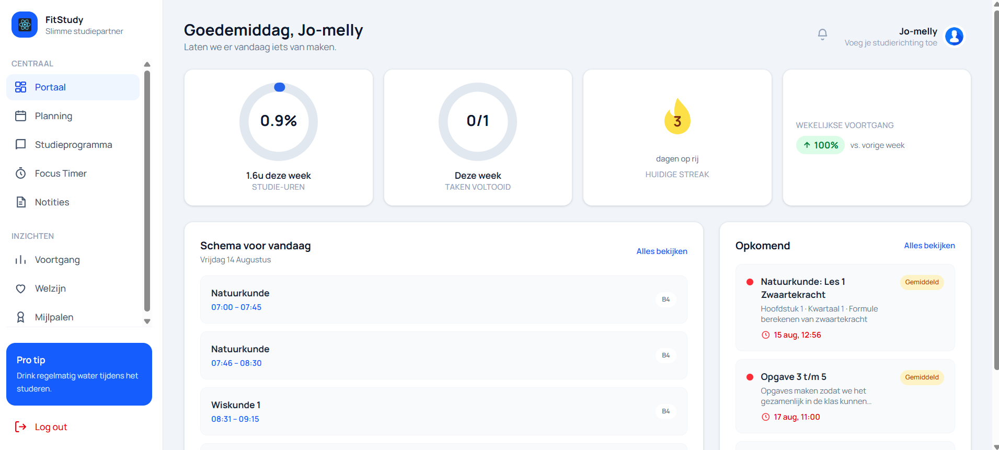

### Onderdelen van het portaal

Het portaal bestaat uit verschillende onderdelen:

#### 1. Overzichtskaarten
Bovenaan het portaal ziet de student verschillende overzichtskaarten.  
Deze kaarten geven snel informatie over de studieactiviteiten, zoals:

- **Studie-uren deze week**  
  Toont hoeveel uren de student deze week heeft gestudeerd.

- **Taken voltooid deze week**  
  Toont hoeveel taken in de huidige week zijn afgerond.

- **Huidige streak**  
  Laat zien hoeveel dagen achter elkaar de student actief is geweest.

- **Wekelijkse voortgang**  
  Geeft een kort overzicht van de voortgang van de afgelopen week.

#### 2. Verdergaan-sectie
In het midden van het portaal kan een blok zichtbaar zijn waarmee de student snel verder kan gaan waar hij of zij gebleven was.  
Als er nog geen gegevens of vakken zijn toegevoegd, kan deze sectie leeg zijn.

#### 3. Voortgang per vak
Onderaan het portaal ziet de student een overzicht van de voortgang per vak.  
Hiermee kan de student volgen hoe ver hij of zij staat per actief vak.

#### 4. Zoekbalk
Bovenaan het scherm staat een **zoekbalk**.  
Met deze zoekfunctie kan de student snel zoeken naar bijvoorbeeld:
- vakken;
- lessen;
- notities.

Deze functie helpt de student om sneller informatie terug te vinden binnen de applicatie.

#### 5. Notificaties
Naast de zoekbalk staat een **bel-icoon**.  
Via dit icoon kan de student meldingen of notificaties bekijken.

Voorbeelden van notificaties kunnen zijn:
- herinneringen;
- updates;
- meldingen binnen de applicatie.

#### 6. Profielknop
Rechtsboven in het scherm staat de **profielknop**.  
Wanneer de student hierop klikt, kan hij of zij het eigen profiel bekijken.

In het profiel zijn onder andere de volgende gegevens zichtbaar:
- naam;
- school e-mailadres;
- telefoonnummer;
- studentnummer;
- school;
- opleiding;
- huidig schooljaar;
- klas.

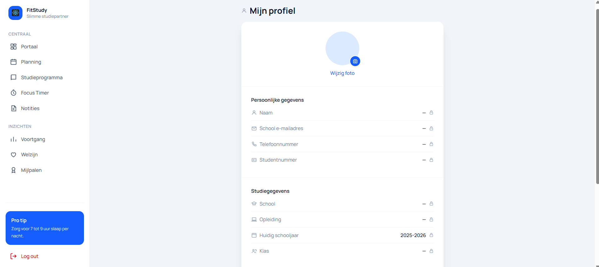

### Belangrijk over profielgegevens

De gegevens in het profiel zijn **alleen ter inzage** voor studenten en docenten.  
Dit betekent dat zij deze gegevens **niet zelf kunnen wijzigen**.

Alleen een **admin** heeft de rechten om deze gegevens aan te passen.

### Stappen om het portaal te gebruiken

1. Log in op FitStudy met uw e-mailadres en wachtwoord.  
2. Na het inloggen wordt het **portaal** geopend.  
3. Bekijk de overzichtskaarten voor uw studiegegevens.  
4. Gebruik de **zoekbalk** om snel vakken, lessen of notities te zoeken.  
5. Klik op het **bel-icoon** om notificaties te bekijken.  
6. Klik op de **profielknop** rechtsboven om uw persoonlijke en studiegegevens te bekijken.  

### Opmerking

Sommige onderdelen van het portaal kunnen leeg zijn wanneer er nog geen vakken, taken of andere gegevens zijn toegevoegd.

## Planning

Via het onderdeel **Planning** kan de student zijn of haar studieplanning bekijken en taken plannen.  
De planning helpt de student om overzicht te houden over lessen, deadlines en taken per dag, week of maand.

De vakken en lessen worden vanuit het systeem opgehaald.

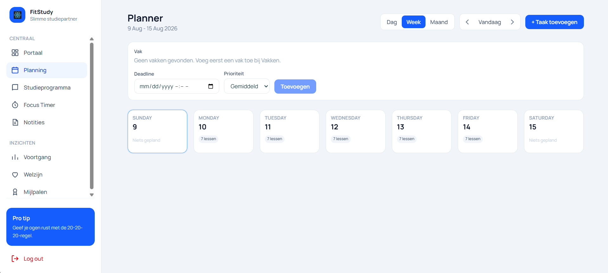

### Onderdelen van de planning

De planningspagina bestaat uit verschillende onderdelen.

#### 1. Weergave kiezen

Rechtsboven kan de student kiezen hoe de planning wordt weergegeven.

Er zijn drie opties:

- **Dag**  
  Toont de planning van één specifieke dag.

- **Week**  
  Toont de planning van een volledige week.

- **Maand**  
  Toont de planning van een volledige maand.

In het voorbeeld staat de planning op **Week**. Hierdoor ziet de student de dagen van de geselecteerde week naast elkaar.

#### 2. Weekperiode

Bovenaan de pagina staat de periode van de huidige planning.  
Bijvoorbeeld:

**9 Aug - 15 Aug 2026**

Dit laat zien voor welke week de planning momenteel wordt getoond.

#### 3. Navigeren tussen periodes

Met de pijltjes naast de knop **Vandaag** kan de student naar een vorige of volgende periode gaan.

- Met het pijltje naar links gaat de student naar de vorige dag, week of maand.
- Met het pijltje naar rechts gaat de student naar de volgende dag, week of maand.
- Met de knop **Vandaag** keert de student terug naar de huidige datum.

#### 4. Taak toevoegen

Met de knop **+ Taak toevoegen** kan de student een nieuwe taak aanmaken.

Bij het toevoegen van een taak kan de student onder andere aangeven:

- bij welk vak de taak hoort;
- wat de deadline is;
- welke prioriteit de taak heeft.

#### 5. Vak selecteren

Bij het toevoegen van een taak kiest de student eerst het vak waarvoor de taak bedoeld is.  
De beschikbare vakken worden vanuit de database opgehaald.

Als er geen vakken zichtbaar zijn, betekent dit dat er op dat moment nog geen vakken aan het account of de klas van de student gekoppeld zijn.

#### 6. Deadline instellen

Bij **Deadline** kan de student aangeven wanneer de taak afgerond moet zijn.

De deadline helpt de student om tijdig te plannen en voorkomt dat opdrachten worden vergeten.

#### 7. Prioriteit kiezen

Bij **Prioriteit** kan de student aangeven hoe belangrijk de taak is.

De mogelijke prioriteiten zijn bijvoorbeeld:

- Laag
- Gemiddeld
- Hoog

Een taak met een hoge prioriteit vraagt meer aandacht dan een taak met een lagere prioriteit.

#### 8. Dagenoverzicht

In het midden van de pagina ziet de student de dagen van de gekozen periode.

Bij de weekweergave worden de dagen naast elkaar weergegeven, bijvoorbeeld:

- Sunday
- Monday
- Tuesday
- Wednesday
- Thursday
- Friday
- Saturday

Per dag kan de student zien of er lessen of geplande taken zijn.

### Stappen om een taak toe te voegen

Volg de onderstaande stappen om een taak toe te voegen aan de planning:

1. Open het onderdeel **Planning** in het linkermenu.
2. Kies de gewenste weergave: **Dag**, **Week** of **Maand**.
3. Klik op **+ Taak toevoegen**.
4. Selecteer het vak waarvoor de taak bedoeld is.
5. Kies een deadline.
6. Selecteer de juiste prioriteit.
7. Klik op **Toevoegen**.

Na het toevoegen verschijnt de taak in de planning.

### Gebruik van de planning

De planning helpt de student om:

- lessen overzichtelijk te bekijken;
- deadlines beter te beheren;
- taken per dag, week of maand te plannen;
- prioriteiten te stellen;
- studieactiviteiten beter te organiseren.

### Opmerking

Als er nog geen vakken, lessen of taken gekoppeld zijn, kan de planning nog leeg zijn.  
De inhoud van de planning hangt af van de gegevens die in het systeem beschikbaar zijn.

## Studieprogramma

Via het onderdeel **Studieprogramma** kan de student het lesrooster en de beschikbare vakken bekijken.  
Dit onderdeel geeft de student inzicht in de vakken, lessen en studievoortgang die aan zijn of haar klas gekoppeld zijn.

De informatie in het studieprogramma wordt vanuit het systeem opgehaald.  
Dit betekent dat de student de vakken en lessen niet zelf hoeft toe te voegen.

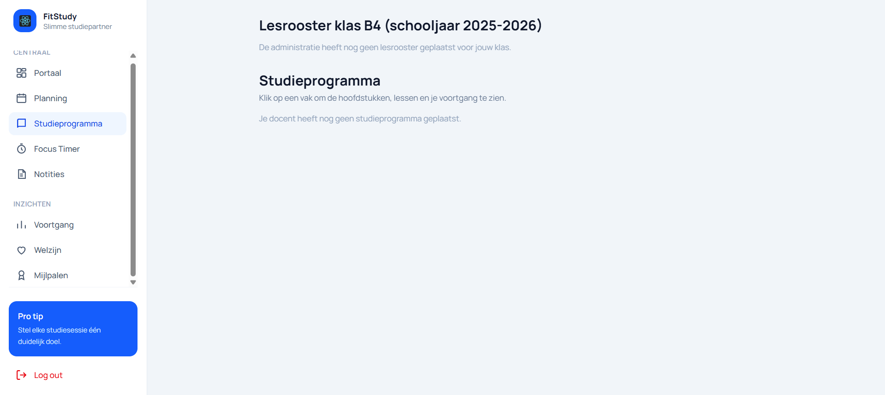

### Onderdelen van het studieprogramma

De pagina **Studieprogramma** bestaat uit twee belangrijke onderdelen:

- het lesrooster van de klas;
- het studieprogramma met vakken en lessen.

### Lesrooster

Bovenaan de pagina ziet de student het lesrooster van zijn of haar klas.

In het voorbeeld staat:
**"Lesrooster klas B4 schooljaar 2025-2026"**

Hiermee ziet de student voor welke klas en welk schooljaar het rooster geldt.

Wanneer er nog geen lesrooster beschikbaar is, kan de volgende melding zichtbaar zijn:
**"De administratie heeft nog geen lesrooster geplaatst voor jouw klas".**

Dit betekent dat het rooster nog niet door de administratie of admin in het systeem is gezet.

### Studieprogramma

Onder het lesrooster staat het onderdeel **Studieprogramma**.

Hier kan de student de vakken bekijken die aan zijn of haar klas gekoppeld zijn.  
Wanneer er vakken beschikbaar zijn, kan de student op een vak klikken om meer details te bekijken.

Binnen een vak kunnen onder andere de volgende onderdelen zichtbaar zijn:

- hoofdstukken;
- lessen;
- opdrachten;
- voortgang per les of onderdeel.

### Voortgang bekijken

Het studieprogramma helpt de student om te zien welke onderdelen al zijn afgerond en welke onderdelen nog openstaan.

Hierdoor kan de student beter volgen:

- welke lessen al bekeken of afgerond zijn;
- welke onderdelen nog gedaan moeten worden;
- hoeveel voortgang er per vak is gemaakt.

### Geen studieprogramma beschikbaar

Wanneer er nog geen studieprogramma is toegevoegd, kan de volgende melding zichtbaar zijn:
**"Je docent heeft nog geen studieprogramma geplaatst."**

Dit betekent dat er nog geen vakken, hoofdstukken of lessen beschikbaar zijn voor de student.

De student hoeft in dit geval niets zelf aan te maken.  
De informatie wordt later toegevoegd door de docent of admin.

### Stappen om het studieprogramma te gebruiken

Volg de onderstaande stappen om het studieprogramma te gebruiken:

1. Klik in het linkermenu op **Studieprogramma**.
2. Bekijk bovenaan het lesrooster van de klas.
3. Controleer of er vakken beschikbaar zijn in het studieprogramma.
4. Klik op een vak om de hoofdstukken, lessen en voortgang te bekijken.
5. Gebruik de informatie om te zien welke onderdelen nog afgerond moeten worden.

### Belangrijk

Studenten kunnen het studieprogramma alleen bekijken en gebruiken.  
Zij kunnen zelf geen vakken, lessen of lesroosters aanpassen.

Het toevoegen en wijzigen van vakken, lessen en roosters wordt gedaan door bevoegde gebruikers, zoals docenten of admins.

## Focus Timer

Via het onderdeel **Focus Timer** kan de student een focussessie starten om geconcentreerd te studeren.

In de nieuwe versie van FitStudy kiest de student eerst een **type focussessie**.  
Elke sessie heeft een eigen duur en moeilijkheidsgraad. Hierdoor kan de student een sessie kiezen die past bij de beschikbare tijd en het gewenste concentratieniveau.

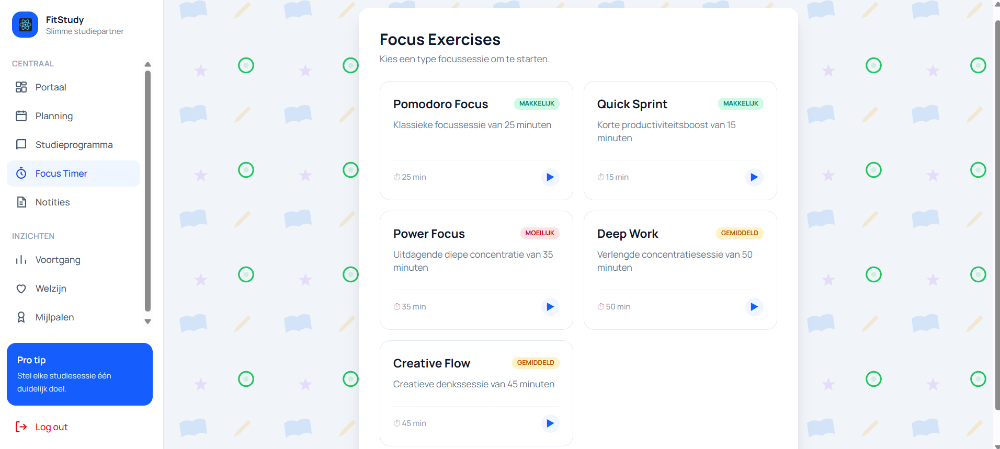

### Onderdelen van de focus timer

De pagina **Focus Timer** bestaat uit verschillende focussessies die de student kan kiezen.

Per sessie zijn de volgende onderdelen zichtbaar:

- **Naam van de sessie**  
  Toont de naam van de focussessie, zoals:
  - **Pomodoro Focus**
  - **Quick Sprint**
  - **Power Focus**
  - **Deep Work**
  - **Creative Flow**

- **Beschrijving van de sessie**  
  Geeft kort aan waarvoor de sessie bedoeld is.

- **Moeilijkheidsgraad**  
  Laat zien hoe intensief de sessie is.  
  In het voorbeeld worden de niveaus weergegeven als:
  - **Makkelijk**
  - **Gemiddeld**
  - **Moeilijk**

- **Duur van de sessie**  
  Toont hoeveel minuten de focussessie duurt.

- **Startknop**  
  Met het **play-icoon** kan de student direct de gekozen focussessie starten.

### Beschikbare focussessies

De student kan kiezen uit meerdere soorten focussessies:

- **Pomodoro Focus**  
  Klassieke focussessie van **25 minuten**.

- **Quick Sprint**  
  Korte productiviteitsboost van **15 minuten**.

- **Power Focus**  
  Uitdagende diepe concentratiesessie van **35 minuten**.

- **Deep Work**  
  Verlengde concentratiesessie van **50 minuten**.

- **Creative Flow**  
  Creatieve denksessie van **45 minuten**.

### Doel van de focus timer

De focus timer helpt de student om:

- gericht aan een studiesessie te werken;
- een sessie te kiezen die past bij de beschikbare tijd;
- de concentratie te verbeteren;
- afleiding te verminderen;
- een vaste studieroutine op te bouwen.

### Stappen om de focus timer te gebruiken

Volg de onderstaande stappen om de focus timer te gebruiken:

1. Klik in het linkermenu op **Focus Timer**.
2. Bekijk de beschikbare focussessies.
3. Kies een sessie die past bij uw studiebehoefte.
4. Controleer de **duur** en de **moeilijkheidsgraad** van de sessie.
5. Klik op het **play-icoon** bij de gewenste sessie.
6. Start de focussessie en werk gedurende die tijd geconcentreerd.

### Belangrijk

De focus timer biedt meerdere soorten focussessies, zodat de student flexibel kan kiezen tussen een korte, gemiddelde of langere studiesessie.

### Opmerking

De focus timer is bedoeld als hulpmiddel om studeren beter te organiseren en de concentratie te verbeteren. De student kan zelf bepalen welke focussessie het beste past bij het moment en de studieactiviteit.

## Notities

Via het onderdeel **Notities** kan de student berichten bekijken die door docent(en) zijn verstuurd.

Deze berichten kunnen bijvoorbeeld bestaan uit:
- feedback over de voortgang;
- herinneringen aan opdrachten;
- mededelingen over lessen;
- algemene informatie voor de klas.

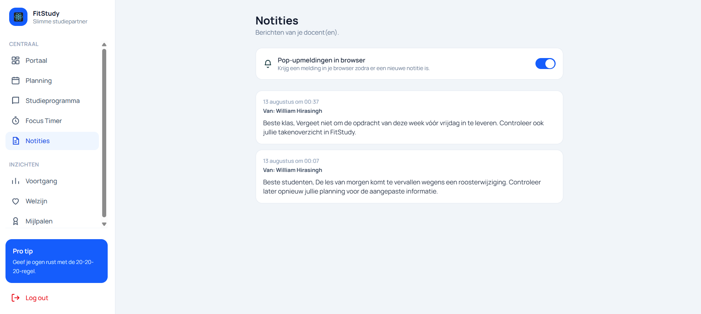

### Onderdelen van de notitiespagina

De pagina **Notities** bestaat uit verschillende onderdelen.

### Berichten van docent(en)

Onder de titel **Notities** ziet de student de ontvangen berichten van docent(en).

Per notitie kunnen onder andere de volgende gegevens zichtbaar zijn:
- **datum en tijd** van het bericht;
- **naam van de docent**;
- **inhoud van het bericht**.

Hierdoor kan de student eenvoudig terugzien wanneer een bericht is verstuurd en van wie het afkomstig is.

### Pop-upmeldingen in browser

Bovenaan de pagina staat de optie **Pop-upmeldingen in browser**.

Met deze optie kan de student browsermeldingen ontvangen zodra er een nieuwe notitie beschikbaar is.

Wanneer deze functie is ingeschakeld:
- ontvangt de student sneller een melding van nieuwe berichten;
- hoeft de student niet steeds handmatig te controleren of er een nieuwe notitie is.

### Notities bekijken

De notities worden in overzichtelijke berichtvakken weergegeven.

In elk berichtvak kan de student zien:
- wanneer het bericht is geplaatst;
- van welke docent het bericht afkomstig is;
- wat de mededeling of feedback inhoudt.

Op deze manier kan de student de ontvangen informatie rustig nalezen.

### Rechten van de student

De student kan notities alleen **bekijken**.

De student kan:
- geen notities aanmaken;
- geen notities wijzigen;
- geen notities verwijderen.

Notities worden geplaatst door docent(en).

### Stappen om notities te bekijken

Volg de onderstaande stappen om notities te bekijken:

1. Klik in het linkermenu op **Notities**.
2. Bekijk de ontvangen berichten van docent(en).
3. Lees per bericht de **datum**, **afzender** en **inhoud**.
4. Schakel indien gewenst **Pop-upmeldingen in browser** in.
5. Controleer regelmatig of er nieuwe notities beschikbaar zijn.

### Belangrijk

Notities zijn bedoeld als communicatie van docent(en) naar de student.  
Het is daarom belangrijk dat de student deze berichten regelmatig controleert, zodat belangrijke informatie over lessen, opdrachten of wijzigingen niet gemist wordt.

## Voortgang

Via het onderdeel **Voortgang** kan de student zijn of haar studieactiviteiten en resultaten bekijken.

Deze pagina geeft een overzicht van de voortgang binnen de huidige maand. De student kan hier onder andere zien hoeveel focussessies zijn gedaan, hoeveel taken zijn voltooid en welke cijfers zijn behaald.

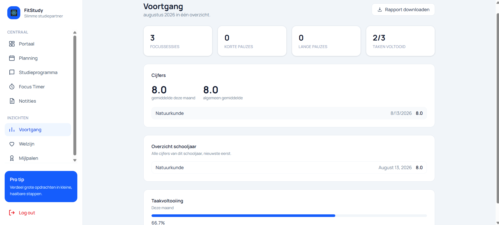

### Onderdelen van de voortgangspagina

De pagina **Voortgang** bestaat uit verschillende onderdelen.

### Maandoverzicht

Bovenaan de pagina staat de naam van de huidige maand met een korte samenvatting, bijvoorbeeld:

**augustus 2026 in één overzicht**

Hiermee ziet de student dat de getoonde voortgang betrekking heeft op de geselecteerde maand.

### Overzichtskaarten

Bovenaan de pagina staan verschillende overzichtskaarten.  
Deze kaarten tonen belangrijke cijfers over de studieactiviteiten van de student.

De overzichtskaarten kunnen onder andere het volgende tonen:

- **Focussessies**  
  Toont hoeveel focussessies de student in deze maand heeft uitgevoerd.

- **Korte pauzes**  
  Toont hoeveel korte pauzes zijn genomen.

- **Lange pauzes**  
  Toont hoeveel lange pauzes zijn genomen.

- **Taken voltooid**  
  Toont hoeveel taken zijn afgerond ten opzichte van het totaal aantal taken.

Deze kaarten helpen de student om snel te zien hoe actief hij of zij is geweest.

### Rapport downloaden

Rechtsboven op de pagina staat de knop **Rapport downloaden**.

Met deze knop kan de student een voortgangsrapport downloaden.  
Dit rapport kan worden gebruikt om de eigen voortgang buiten de applicatie te bewaren of te bekijken.

### Cijfers

In het onderdeel **Cijfers** ziet de student een overzicht van behaalde resultaten.

Hier kunnen onder andere de volgende gegevens zichtbaar zijn:

- **gemiddelde deze maand**  
  Toont het gemiddelde van de cijfers die in de huidige maand zijn geregistreerd.

- **algemeen gemiddelde**  
  Toont het gemiddelde van alle geregistreerde cijfers.

- **vaknaam**  
  Toont voor welk vak een cijfer is geregistreerd.

- **datum**  
  Toont wanneer het cijfer is geregistreerd.

- **cijfer**  
  Toont het behaalde resultaat.

Dit onderdeel helpt de student om de recente resultaten snel te bekijken.

### Overzicht schooljaar

Onder **Overzicht schooljaar** ziet de student alle geregistreerde cijfers van het huidige schooljaar.

De cijfers worden weergegeven met de nieuwste resultaten eerst.

Per resultaat kunnen onder andere de volgende gegevens zichtbaar zijn:

- **vaknaam**
- **datum**
- **cijfer**

Hierdoor kan de student ook over een langere periode de schoolresultaten volgen.

### Taakvoltooiing

Onder het onderdeel **Taakvoltooiing** ziet de student hoeveel taken in de huidige maand zijn afgerond.

Dit onderdeel bevat:

- een **voortgangsbalk**;
- een **percentage** van de afgeronde taken.

Hiermee krijgt de student snel inzicht in de voortgang van de eigen planning en opdrachten.

### Stappen om de voortgang te bekijken

Volg de onderstaande stappen om de voortgang te bekijken:

1. Klik in het linkermenu op **Voortgang**.
2. Bekijk bovenaan de overzichtskaarten.
3. Controleer het aantal **focussessies**, **korte pauzes**, **lange pauzes** en **voltooide taken**.
4. Bekijk het onderdeel **Cijfers** voor de recente resultaten.
5. Bekijk het onderdeel **Overzicht schooljaar** om oudere resultaten terug te zien.
6. Controleer onder **Taakvoltooiing** hoeveel taken deze maand zijn afgerond.
7. Klik eventueel op **Rapport downloaden** om een rapport van de voortgang te downloaden.

### Belangrijk

De voortgangspagina is bedoeld om de student inzicht te geven in zijn of haar studiegedrag en prestaties.

### Opmerking

De gegevens op deze pagina zijn afhankelijk van de activiteiten en resultaten die in FitStudy zijn geregistreerd. Wanneer er nog weinig gegevens beschikbaar zijn, kunnen sommige onderdelen nog beperkt gevuld zijn.

## Welzijn

Via het onderdeel **Welzijn** kan de student werken aan een gezonde en gebalanceerde studieroutine.

Deze pagina helpt de student om niet alleen op studie te focussen, maar ook op ontspanning, motivatie, zelfreflectie en waterinname.  
Bovenaan de pagina kan de student wisselen tussen verschillende tabbladen binnen het onderdeel welzijn.

Daarnaast is rechtsboven een **statuslabel** zichtbaar, zoals **Risico**.  
Dit label geeft een algemene indicatie van het welzijn van de student op basis van de beschikbare gegevens.

### Onderdelen van welzijn

De pagina **Welzijn** bestaat uit vijf onderdelen:

- **Ontspanning**
- **Dagelijkse begeleiding**
- **Registratie**
- **Waterinname**
- **Quiz**

### Ontspanning

Bij het tabblad **Ontspanning** krijgt de student verschillende korte activiteiten te zien die helpen om te ontspannen tijdens of na het studeren.

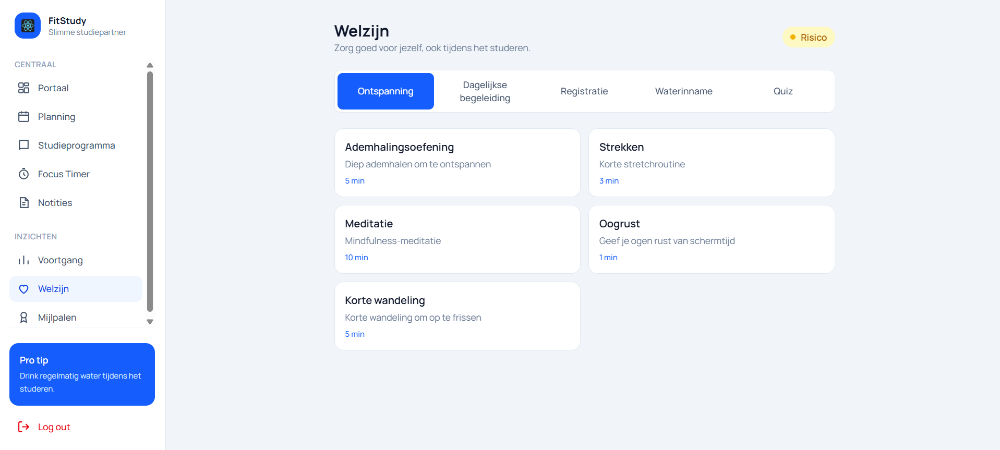

Voorbeelden van ontspanningsactiviteiten zijn:

- **Ademhalingsoefening**
- **Strekken**
- **Meditatie**
- **Oogrust**
- **Korte wandeling**

Bij iedere activiteit staat een korte beschrijving en de duur, bijvoorbeeld **1 min**, **3 min**, **5 min** of **10 min**.

Dit onderdeel helpt de student om:
- stress te verminderen;
- tussendoor bewust te pauzeren;
- de concentratie te verbeteren;
- gezondere studiegewoonten op te bouwen.

### Dagelijkse begeleiding

Bij het tabblad **Dagelijkse begeleiding** ziet de student een motiverende tip of korte begeleidende boodschap.

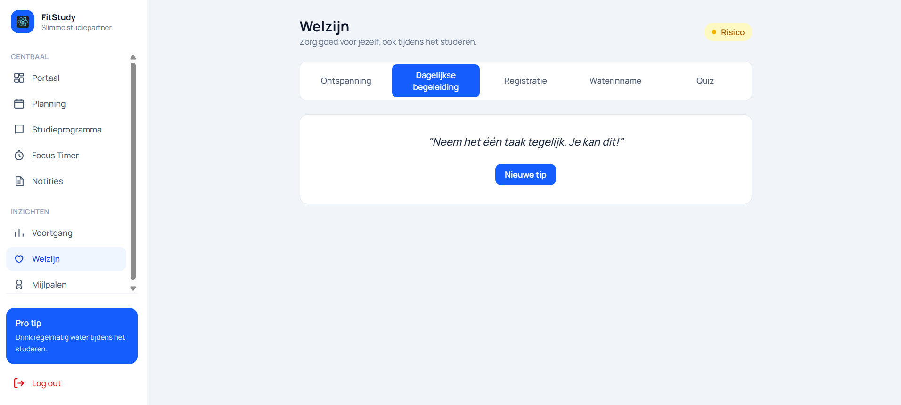

Op deze pagina wordt een korte tekst getoond die de student kan ondersteunen of motiveren, bijvoorbeeld:

**"Neem het één taak tegelijk. Je kan dit!"**

Met de knop **Nieuwe tip** kan een andere motiverende boodschap worden opgehaald.

Dit onderdeel is bedoeld om de student dagelijks op een positieve manier te ondersteunen.

### Registratie

Bij het tabblad **Registratie** kan de student persoonlijke welzijnsgegevens van die dag invoeren.

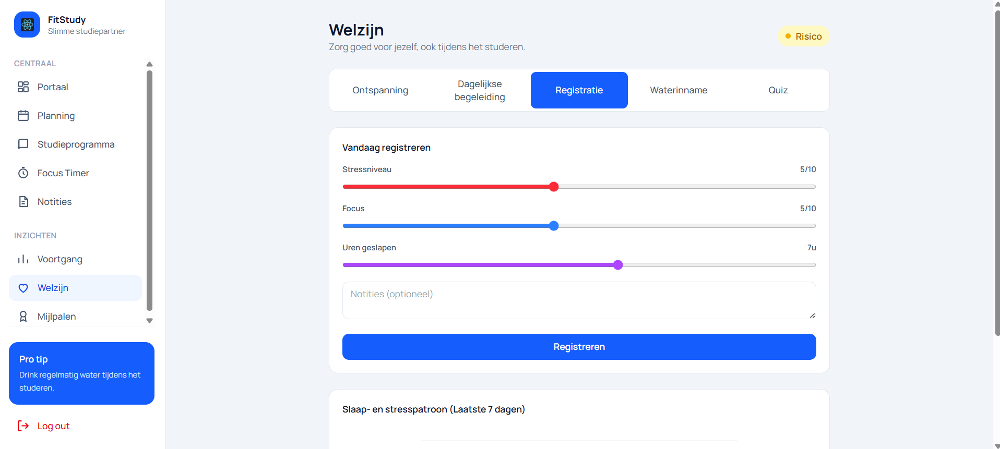

Hier kan de student onder andere registreren:

- **Stressniveau**
- **Focus**
- **Uren geslapen**
- **Notities (optioneel)**

De student vult deze gegevens in met schuifbalken en een notitieveld.  
Na het invullen klikt de student op **Registreren** om de gegevens op te slaan.

Onder het registratiegedeelte kan ook een overzicht zichtbaar zijn van het **slaap- en stresspatroon van de laatste 7 dagen**.  
Hiermee kan de student beter inzicht krijgen in het eigen welzijnspatroon.

### Stappen om een welzijnsregistratie toe te voegen

Volg de onderstaande stappen om een registratie toe te voegen:

1. Klik op het tabblad **Registratie**.
2. Stel het **stressniveau** in.
3. Stel het **focusniveau** in.
4. Geef aan hoeveel **uren geslapen** zijn.
5. Voeg eventueel een **notitie** toe.
6. Klik op **Registreren**.

### Waterinname

Bij het tabblad **Waterinname** kan de student de dagelijkse waterinname bijhouden.

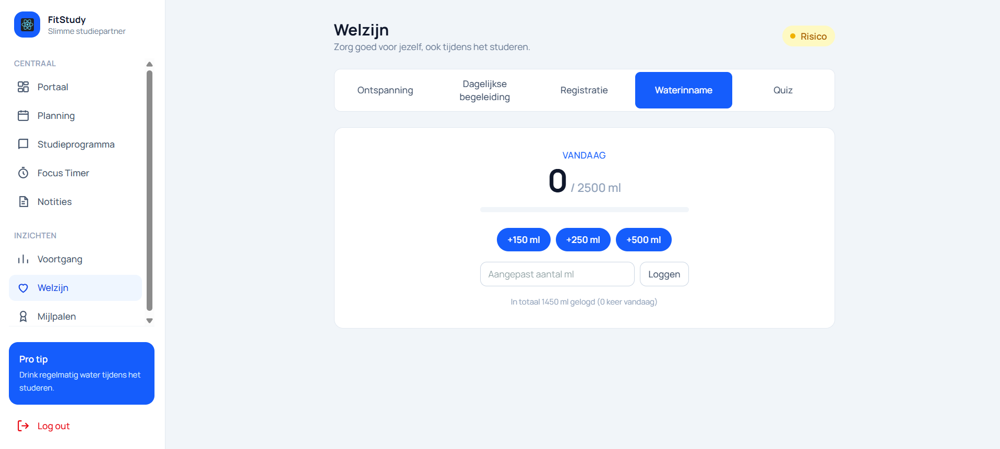

De student ziet hier onder andere:

- hoeveel milliliter water vandaag is geregistreerd;
- het dagelijkse doel, bijvoorbeeld **2500 ml**;
- een **voortgangsbalk**;
- snelle knoppen zoals **+150 ml**, **+250 ml** en **+500 ml**;
- een invoerveld voor een **aangepast aantal ml**;
- de knop **Loggen** om de invoer op te slaan.

Onderaan wordt ook een korte samenvatting weergegeven van de totaal gelogde hoeveelheid water.

Dit onderdeel helpt de student om tijdens het studeren voldoende water te drinken.

### Stappen om waterinname te registreren

Volg de onderstaande stappen om waterinname te registreren:

1. Klik op het tabblad **Waterinname**.
2. Kies een snelle hoeveelheid, zoals **+150 ml**, **+250 ml** of **+500 ml**.  
   of
3. Vul zelf een hoeveelheid in bij **Aangepast aantal ml**.
4. Klik op **Loggen**.
5. Controleer de voortgangsbalk en het totaal van de dag.

### Quiz

Bij het tabblad **Quiz** krijgt de student vragen over het eigen welzijn.

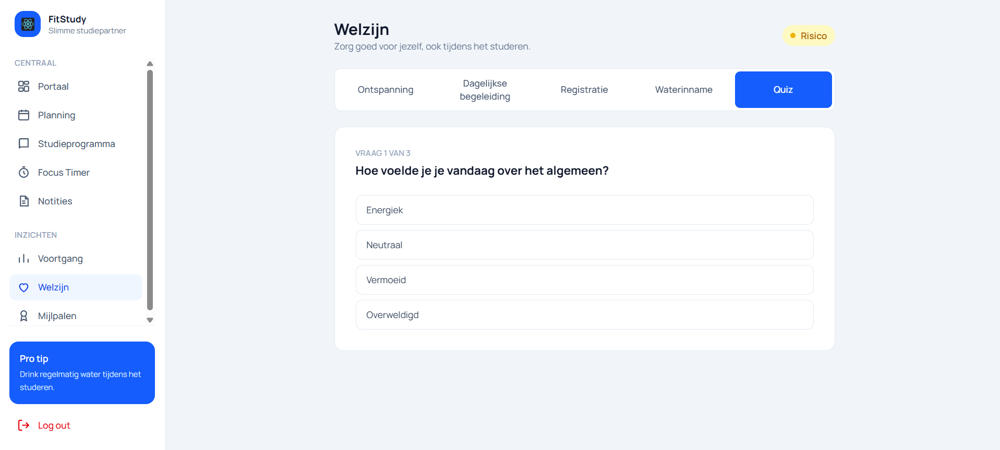

In de quiz wordt per vraag een situatie of gevoel voorgelegd.  
De student kiest vervolgens het antwoord dat het beste past bij de eigen situatie.

In het voorbeeld wordt onder andere gevraagd:

**"Hoe voelde je je vandaag over het algemeen?"**

Daarbij zijn antwoordopties zichtbaar zoals:

- **Energiek**
- **Neutraal**
- **Vermoeid**
- **Overweldigd**

Boven de vraag is ook zichtbaar hoeveel vragen de quiz bevat, bijvoorbeeld **Vraag 1 van 3**.

De quiz helpt de student om stil te staan bij het eigen welzijn en kan bijdragen aan een beter inzicht in de eigen mentale en fysieke toestand.

### Stappen om de quiz te gebruiken

Volg de onderstaande stappen om de quiz te gebruiken:

1. Klik op het tabblad **Quiz**.
2. Lees de vraag aandachtig.
3. Kies het antwoord dat het beste bij uw situatie past.
4. Beantwoord de volgende vragen indien beschikbaar.
5. Rond de quiz af.

### Belangrijk

Het onderdeel **Welzijn** is bedoeld om de student te ondersteunen bij een gezonde studie- en leefroutine.  
De informatie en registraties helpen de student om bewuster om te gaan met stress, focus, slaap, ontspanning en hydratatie.

### Opmerking

De weergegeven welzijnsstatus, zoals **Risico**, is afhankelijk van de gegevens die de student in FitStudy registreert. Wanneer er weinig of geen registraties beschikbaar zijn, kan het welzijnsoverzicht beperkter zijn.

## Mijlpalen

Via het onderdeel **Mijlpalen** kan de student badges en behaalde prestaties bekijken.

Deze pagina geeft een overzicht van de voortgang binnen verschillende categorieën.  
De student kan hier zien hoeveel badges al zijn behaald en welke mijlpalen nog openstaan.

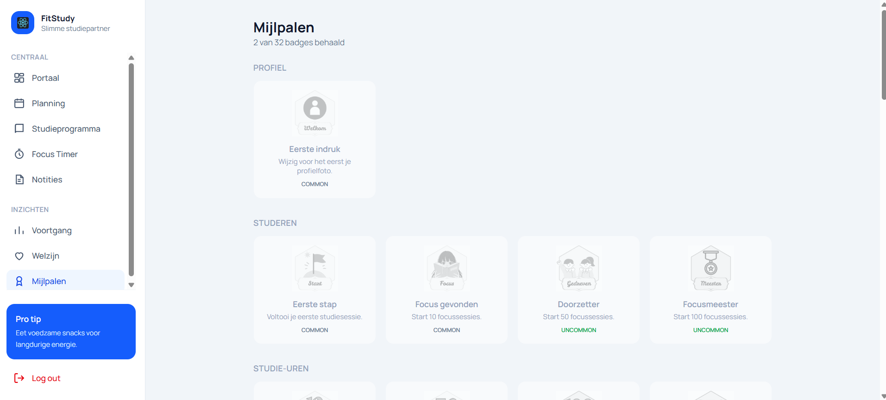

### Onderdelen van de mijlpalenpagina

De pagina **Mijlpalen** bestaat uit verschillende onderdelen.

### Totaaloverzicht

Bovenaan de pagina ziet de student hoeveel badges al zijn behaald.

In het voorbeeld staat:

**2 van 32 badges behaald**

Hiermee krijgt de student direct een algemeen overzicht van de voortgang binnen het badge-systeem.

### Categorieën

De badges zijn verdeeld in verschillende categorieën.  
In het voorbeeld zijn onder andere de volgende categorieën zichtbaar:

- **Profiel**
- **Studeren**
- **Studie-uren**

Per categorie worden de bijbehorende badges overzichtelijk weergegeven.

### Badge-informatie

Per badge kan de student de volgende informatie bekijken:

- **Naam van de badge**  
  Toont de naam van de mijlpaal, bijvoorbeeld:
  - **Eerste indruk**
  - **Eerste stap**
  - **Focus gevonden**
  - **Doorzetter**
  - **Focusmeester**

- **Beschrijving**  
  Geeft aan wat de student moet doen om de badge te behalen.

- **Zeldzaamheid / niveau**  
  Toont het type badge, bijvoorbeeld:
  - **Common**
  - **Uncommon**

### Voorbeelden van badges

Op de pagina kunnen bijvoorbeeld badges zichtbaar zijn zoals:

- **Eerste indruk**  
  Wijzig voor het eerst je profielfoto.

- **Eerste stap**  
  Voltooi je eerste studiesessie.

- **Focus gevonden**  
  Start 10 focussessies.

- **Doorzetter**  
  Start 50 focussessies.

- **Focusmeester**  
  Start 100 focussessies.

Deze badges helpen de student om gemotiveerd te blijven en stap voor stap doelen te behalen.

### Doel van mijlpalen

Het onderdeel **Mijlpalen** helpt de student om:

- zicht te krijgen op behaalde prestaties;
- gemotiveerd te blijven tijdens het studeren;
- persoonlijke voortgang te volgen;
- extra doelen binnen FitStudy na te streven.

### Stappen om mijlpalen te bekijken

Volg de onderstaande stappen om mijlpalen te bekijken:

1. Klik in het linkermenu op **Mijlpalen**.
2. Bekijk bovenaan hoeveel badges al zijn behaald.
3. Scroll door de verschillende **categorieën**.
4. Bekijk per badge de **naam**, **beschrijving** en **zeldzaamheid**.
5. Gebruik het overzicht om te zien welke mijlpalen al zijn behaald en welke nog openstaan.

### Belangrijk

Mijlpalen zijn bedoeld als extra motivatie binnen FitStudy.  
Ze helpen de student om studieactiviteiten en persoonlijke voortgang op een visuele manier te volgen.

### Opmerking

De badges die zichtbaar zijn, zijn afhankelijk van de activiteiten die de student in FitStudy uitvoert. Naarmate de student meer functies gebruikt en meer doelen behaalt, zullen extra badges beschikbaar of behaald worden.

## Pro tip en uitloggen

Onderaan het linkermenu staan twee vaste onderdelen: **Pro tip** en **Log out**.

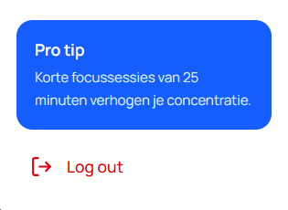

### Pro tip

De **Pro tip** toont een korte studietip of welzijnstip voor de student.

Voorbeelden van tips zijn:

- korte focussessies van 25 minuten kunnen de concentratie verbeteren;
- voldoende slaap helpt bij beter studeren;
- regelmatig pauzeren helpt om gefocust te blijven.

De tip kan veranderen en is bedoeld om de student op een eenvoudige manier te ondersteunen tijdens het studeren.

### Log out

Met de knop **Log out** kan de student uitloggen uit FitStudy.

Wanneer de student op **Log out** klikt, wordt de actieve sessie afgesloten.  
Daarna moet de student opnieuw inloggen om weer toegang te krijgen tot het dashboard.

### Belangrijk

Het is verstandig om altijd uit te loggen wanneer FitStudy wordt gebruikt op een gedeelde computer of schoolcomputer.  
Zo blijven persoonlijke gegevens en studiegegevens beter beschermd.